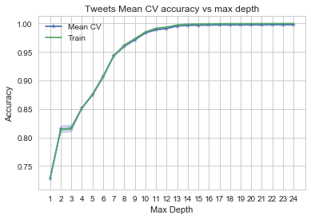
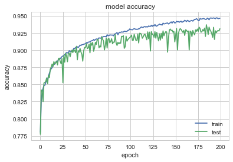
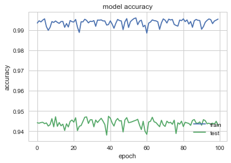
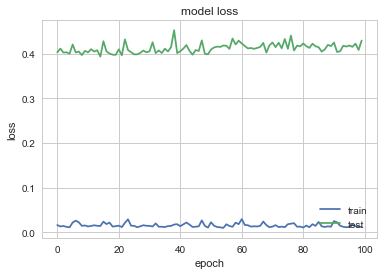

```python
import numpy as np
import pandas as pd
import matplotlib.pyplot as plt

from sklearn.model_selection import cross_val_score, train_test_split
from sklearn.utils import resample
from sklearn.tree import DecisionTreeClassifier
from sklearn.ensemble import RandomForestClassifier
from sklearn.ensemble import AdaBoostClassifier
from sklearn.metrics import accuracy_score,r2_score
from sklearn.neighbors import KNeighborsClassifier
from sklearn.preprocessing import scale
from sklearn.discriminant_analysis import LinearDiscriminantAnalysis
from sklearn.discriminant_analysis import QuadraticDiscriminantAnalysis
from keras.models import Sequential
from keras.layers import Dense
from keras.layers import Dropout

%matplotlib inline

import seaborn as sns
sns.set(style='whitegrid')
pd.set_option('display.width', 1500)
pd.set_option('display.max_columns', 100)

import warnings
warnings.filterwarnings('ignore')
```


#### Create train/test set for accounts and tweets ####

##### Discussion:
The dataset for accounts and tweets are split into train/test ratio of 2/3 and 1/3. In Models_kNN_LDA_QDA_DT_RF notebook we looked at various base models and models using NLP. Here we continue by adding Lexical Diversity Predictors to see if our accuracy improves with all these models. The lexical Diversity features were generated and selected in lexical_diversity NB. These are the additional LD features which we will use to try to improve our model:

| Tweets Features|
|:-------------------|
|LD-uber_index|
|LD-yule_s_k|
|LD-mtld|
|LD-hdd|


```python
combine_df = []
for file_ in ['/Users/smukherjee5/cs109_final_project/cs109a/data/tweets_nlp_1_2_ld.csv','/Users/smukherjee5/cs109_final_project/cs109a/data/tweets_nlp_2_2_ld.csv','/Users/smukherjee5/cs109_final_project/cs109a/data/tweets_nlp_3_2_ld.csv']:
    df = pd.read_csv(file_,index_col=None, header=0,keep_default_na=False)
    combine_df.append(df)
all_tweets = pd.concat(combine_df, axis = 0, ignore_index = True)  

all_tweets[['LD-yule_s_k']] = all_tweets[['LD-yule_s_k']].fillna(0)

def convert_float(val):
    try:
        return float(val)
    except ValueError:
        return 0

all_tweets['LD-yule_s_k']=all_tweets['LD-yule_s_k'].apply(lambda x: convert_float(x))
train_base_tweets_df, test_base_tweets_df = train_test_split(all_tweets, test_size=0.33, random_state=42, stratify=all_tweets['user_type'])

print('train tweets shape:',train_base_tweets_df.shape)
print('test tweets shape:',test_base_tweets_df.shape)

all_tweets_df = all_tweets[['retweet_count', 'favorite_count', 'num_hashtags', 'num_urls', 'num_mentions',
                               'user_type', 'sentiment_negative', 'sentiment_neutral', 'sentiment_positive',
                               'ratio_pos', 'ratio_neg', 'ratio_neu', 'token_count', 'url_token_ratio', 'ant',
                               'disgust', 'fear', 'joy', 'sadness', 'surprise', 'trust','jaccard','LD-uber_index','LD-yule_s_k','LD-mtld','LD-hdd']]

train_base_tweets_df, test_base_tweets_df = train_test_split(all_tweets_df, test_size=0.33, random_state=42,
                                                             stratify=all_tweets_df['user_type'])
X_train, y_train = train_base_tweets_df.drop('user_type',axis=1), train_base_tweets_df['user_type']
X_test, y_test = test_base_tweets_df.drop('user_type',axis=1), test_base_tweets_df['user_type']
```


    train tweets shape: (80574, 60)
    test tweets shape: (39686, 60)


#### kNN with NLP and Lexical Density features


```python
#scale down to 10% or take forever.
Xs_train, Xs_test = scale(X_train), scale(X_test)

neighbors, train_scores, cvmeans, cvstds, cv_scores = [], [], [], [], []
for n in range(1,11):
    neighbors.append(n)
    knn = KNeighborsClassifier(n_neighbors = n)
    train_scores.append(knn.fit(X_train, y_train).score(X_train, y_train))
    scores = cross_val_score(estimator=knn,X=Xs_train, y=y_train, cv=5)
    cvmeans.append(scores.mean())
    cvstds.append(scores.std())

#Alter data structure for using internal numpy functions
cvmeans = np.array(cvmeans)
cvstds = np.array(cvstds)
#Plot Means and Shade the +-2 SD Interval
plt.plot(neighbors, cvmeans, '*-', label="Mean CV")
plt.fill_between(neighbors, cvmeans - 2*cvstds, cvmeans + 2*cvstds, alpha=0.3)
ylim = plt.ylim()
plt.plot(neighbors, train_scores, '-+', label="Train")
plt.ylim(ylim)
plt.legend()
plt.ylabel("Accuracy")
plt.xlabel("Neighbors")
plt.title('Tweets Mean CV accuracy vs max depth')
plt.xticks(neighbors)
plt.show()
```


    ---------------------------------------------------------------------------

    KeyboardInterrupt                         Traceback (most recent call last)

    <ipython-input-5-e73bee2de747> in <module>()
         11     knn = KNeighborsClassifier(n_neighbors = n)
         12     train_scores.append(knn.fit(X_train, y_train).score(X_train, y_train))
    ---> 13     scores = cross_val_score(estimator=knn,X=Xs_train, y=y_train, cv=5)
         14     cvmeans.append(scores.mean())
         15     cvstds.append(scores.std())


    /anaconda3/lib/python3.6/site-packages/sklearn/model_selection/_validation.py in cross_val_score(estimator, X, y, groups, scoring, cv, n_jobs, verbose, fit_params, pre_dispatch)
        340                                 n_jobs=n_jobs, verbose=verbose,
        341                                 fit_params=fit_params,
    --> 342                                 pre_dispatch=pre_dispatch)
        343     return cv_results['test_score']
        344


    /anaconda3/lib/python3.6/site-packages/sklearn/model_selection/_validation.py in cross_validate(estimator, X, y, groups, scoring, cv, n_jobs, verbose, fit_params, pre_dispatch, return_train_score)
        204             fit_params, return_train_score=return_train_score,
        205             return_times=True)
    --> 206         for train, test in cv.split(X, y, groups))
        207
        208     if return_train_score:


    /anaconda3/lib/python3.6/site-packages/sklearn/externals/joblib/parallel.py in __call__(self, iterable)
        777             # was dispatched. In particular this covers the edge
        778             # case of Parallel used with an exhausted iterator.
    --> 779             while self.dispatch_one_batch(iterator):
        780                 self._iterating = True
        781             else:


    /anaconda3/lib/python3.6/site-packages/sklearn/externals/joblib/parallel.py in dispatch_one_batch(self, iterator)
        623                 return False
        624             else:
    --> 625                 self._dispatch(tasks)
        626                 return True
        627


    /anaconda3/lib/python3.6/site-packages/sklearn/externals/joblib/parallel.py in _dispatch(self, batch)
        586         dispatch_timestamp = time.time()
        587         cb = BatchCompletionCallBack(dispatch_timestamp, len(batch), self)
    --> 588         job = self._backend.apply_async(batch, callback=cb)
        589         self._jobs.append(job)
        590


    /anaconda3/lib/python3.6/site-packages/sklearn/externals/joblib/_parallel_backends.py in apply_async(self, func, callback)
        109     def apply_async(self, func, callback=None):
        110         """Schedule a func to be run"""
    --> 111         result = ImmediateResult(func)
        112         if callback:
        113             callback(result)


    /anaconda3/lib/python3.6/site-packages/sklearn/externals/joblib/_parallel_backends.py in __init__(self, batch)
        330         # Don't delay the application, to avoid keeping the input
        331         # arguments in memory
    --> 332         self.results = batch()
        333
        334     def get(self):


    /anaconda3/lib/python3.6/site-packages/sklearn/externals/joblib/parallel.py in __call__(self)
        129
        130     def __call__(self):
    --> 131         return [func(*args, **kwargs) for func, args, kwargs in self.items]
        132
        133     def __len__(self):


    /anaconda3/lib/python3.6/site-packages/sklearn/externals/joblib/parallel.py in <listcomp>(.0)
        129
        130     def __call__(self):
    --> 131         return [func(*args, **kwargs) for func, args, kwargs in self.items]
        132
        133     def __len__(self):


    /anaconda3/lib/python3.6/site-packages/sklearn/model_selection/_validation.py in _fit_and_score(estimator, X, y, scorer, train, test, verbose, parameters, fit_params, return_train_score, return_parameters, return_n_test_samples, return_times, error_score)
        486         fit_time = time.time() - start_time
        487         # _score will return dict if is_multimetric is True
    --> 488         test_scores = _score(estimator, X_test, y_test, scorer, is_multimetric)
        489         score_time = time.time() - start_time - fit_time
        490         if return_train_score:


    /anaconda3/lib/python3.6/site-packages/sklearn/model_selection/_validation.py in _score(estimator, X_test, y_test, scorer, is_multimetric)
        521     """
        522     if is_multimetric:
    --> 523         return _multimetric_score(estimator, X_test, y_test, scorer)
        524     else:
        525         if y_test is None:


    /anaconda3/lib/python3.6/site-packages/sklearn/model_selection/_validation.py in _multimetric_score(estimator, X_test, y_test, scorers)
        551             score = scorer(estimator, X_test)
        552         else:
    --> 553             score = scorer(estimator, X_test, y_test)
        554
        555         if hasattr(score, 'item'):


    /anaconda3/lib/python3.6/site-packages/sklearn/metrics/scorer.py in _passthrough_scorer(estimator, *args, **kwargs)
        242 def _passthrough_scorer(estimator, *args, **kwargs):
        243     """Function that wraps estimator.score"""
    --> 244     return estimator.score(*args, **kwargs)
        245
        246


    /anaconda3/lib/python3.6/site-packages/sklearn/base.py in score(self, X, y, sample_weight)
        347         """
        348         from .metrics import accuracy_score
    --> 349         return accuracy_score(y, self.predict(X), sample_weight=sample_weight)
        350
        351


    /anaconda3/lib/python3.6/site-packages/sklearn/neighbors/classification.py in predict(self, X)
        143         X = check_array(X, accept_sparse='csr')
        144
    --> 145         neigh_dist, neigh_ind = self.kneighbors(X)
        146
        147         classes_ = self.classes_


    /anaconda3/lib/python3.6/site-packages/sklearn/neighbors/base.py in kneighbors(self, X, n_neighbors, return_distance)
        383                 delayed(self._tree.query, check_pickle=False)(
        384                     X[s], n_neighbors, return_distance)
    --> 385                 for s in gen_even_slices(X.shape[0], n_jobs)
        386             )
        387             if return_distance:


    /anaconda3/lib/python3.6/site-packages/sklearn/externals/joblib/parallel.py in __call__(self, iterable)
        777             # was dispatched. In particular this covers the edge
        778             # case of Parallel used with an exhausted iterator.
    --> 779             while self.dispatch_one_batch(iterator):
        780                 self._iterating = True
        781             else:


    /anaconda3/lib/python3.6/site-packages/sklearn/externals/joblib/parallel.py in dispatch_one_batch(self, iterator)
        623                 return False
        624             else:
    --> 625                 self._dispatch(tasks)
        626                 return True
        627


    /anaconda3/lib/python3.6/site-packages/sklearn/externals/joblib/parallel.py in _dispatch(self, batch)
        586         dispatch_timestamp = time.time()
        587         cb = BatchCompletionCallBack(dispatch_timestamp, len(batch), self)
    --> 588         job = self._backend.apply_async(batch, callback=cb)
        589         self._jobs.append(job)
        590


    /anaconda3/lib/python3.6/site-packages/sklearn/externals/joblib/_parallel_backends.py in apply_async(self, func, callback)
        109     def apply_async(self, func, callback=None):
        110         """Schedule a func to be run"""
    --> 111         result = ImmediateResult(func)
        112         if callback:
        113             callback(result)


    /anaconda3/lib/python3.6/site-packages/sklearn/externals/joblib/_parallel_backends.py in __init__(self, batch)
        330         # Don't delay the application, to avoid keeping the input
        331         # arguments in memory
    --> 332         self.results = batch()
        333
        334     def get(self):


    /anaconda3/lib/python3.6/site-packages/sklearn/externals/joblib/parallel.py in __call__(self)
        129
        130     def __call__(self):
    --> 131         return [func(*args, **kwargs) for func, args, kwargs in self.items]
        132
        133     def __len__(self):


    /anaconda3/lib/python3.6/site-packages/sklearn/externals/joblib/parallel.py in <listcomp>(.0)
        129
        130     def __call__(self):
    --> 131         return [func(*args, **kwargs) for func, args, kwargs in self.items]
        132
        133     def __len__(self):


    KeyboardInterrupt:


#### LDA/QDA with NLP and Lexical Diversity Features


```python
lda = LinearDiscriminantAnalysis().fit(X_train, y_train)
qda = QuadraticDiscriminantAnalysis().fit(X_train, y_train)
print("LDA score: %f, CV score: %f" % (accuracy_score(y_test, lda.predict(X_test)), cross_val_score(estimator=lda, X=X_test, y=y_test, cv=5).mean()))
print("QDA score: %f, CV score: %f" % (accuracy_score(y_test, qda.predict(X_test)), cross_val_score(estimator=qda, X=X_test, y=y_test, cv=5).mean()))
```


    LDA score: 0.811369, CV score: 0.811873
    QDA score: 0.774228, CV score: 0.735321


#### Decision Tree with NLP and Lexical Diversity features


```python
#Perform 5-fold cross validation and store results
depths, train_scores, cvmeans, cvstds, cv_scores = [], [], [], [], []
for depth in range(1,25):
    depths.append(depth)
    dt = DecisionTreeClassifier(max_depth=depth)
    train_scores.append(dt.fit(X_train, y_train).score(X_train, y_train))
    scores = cross_val_score(estimator=dt, X=X_train, y=y_train, cv=5)
    cvmeans.append(scores.mean())
    cvstds.append(scores.std())

#Alter data structure for using internal numpy functions
cvmeans = np.array(cvmeans)
cvstds = np.array(cvstds)
#Plot Means and Shade the +-2 SD Interval
plt.plot(depths, cvmeans, '*-', label="Mean CV")
plt.fill_between(depths, cvmeans - 2*cvstds, cvmeans + 2*cvstds, alpha=0.3)
ylim = plt.ylim()
plt.plot(depths, train_scores, '-+', label="Train")
plt.ylim(ylim)
plt.legend()
plt.ylabel("Accuracy")
plt.xlabel("Max Depth")
plt.title('Tweets Mean CV accuracy vs max depth')
plt.xticks(depths)
plt.show()
```





```python
#Choosing the best depth
idx = depths.index(12)
print("Accuracy: Mean={:.3f}, +/- 2 SD: [{:.3f} -- {:.3f}]".format(
    cvmeans[idx], cvmeans[idx] - 2*cvstds[idx], cvmeans[idx] + 2*cvstds[idx]))
```


    Accuracy: Mean=0.991, +/- 2 SD: [0.990 -- 0.993]


```python
#Evaluate performance on Test Set
best_cv_depth = 12
fitted_tree = DecisionTreeClassifier(max_depth=best_cv_depth).fit(X_train, y_train)
best_cv_tree_train_score = fitted_tree.score(X_train, y_train)
best_cv_tree_test_score = fitted_tree.score(X_test, y_test)
print(f"The tree of depth {best_cv_depth} achieved an Accuracy of {best_cv_tree_test_score:.3f} on the test set.")
```


    The tree of depth 12 achieved an Accuracy of 0.993 on the test set.


#### Random Forest with NLP features and LD


```python
#Fit a Random Forest model
fitted_rf = RandomForestClassifier(n_estimators=7, max_depth=13).fit(X_train,y_train)
random_forest_train_score = fitted_rf.score(X_train, y_train)
random_forest_test_score = fitted_rf.score(X_test, y_test)
print(f"The Random Forest scored {random_forest_train_score:.3f} on the training set.")
print(f"The Random Forest scored {random_forest_test_score:.3f} on the test set.")
```


    The Random Forest scored 0.985 on the training set.
    The Random Forest scored 0.982 on the test set.


#### Neural Network without NLP

In this section we try to use Keras to build a layered Neural Net.
We will use a fully-connected network structure with five layers.

Fully connected layers are defined using the Dense class.

We will use the sigmoid activation function on the first layer,softmax activation in the next, rectifier (‘relu‘) activation function on the next two layers and the sigmoid function in the output layer. We use a sigmoid on the output layer to ensure our network output is between 0 and 1 and easy to map to either a probability of class 1 or snap to a hard classification of either class.

We can piece it all together by adding each layer. The first layer has 100 neurons and expects 5 input variables. The second hidden layer has 300 neurons, the third has 100 and the fourth has 50 neurons,respectively.Finally, the output layer has 1 neuron to predict the class (bot or not).


```python
all_tweets_df_no_nlp = all_tweets[['retweet_count', 'favorite_count', 'num_hashtags', 'num_urls', 'num_mentions','user_type']].sample(frac=.30)
train_base_tweets_df_no_nlp, test_base_tweets_df_no_nlp = train_test_split(all_tweets_df_no_nlp, test_size=0.33, random_state=42, stratify=all_tweets_df_no_nlp['user_type'])

X_train_no_nlp, y_train_no_nlp = train_base_tweets_df_no_nlp.drop('user_type',axis=1), train_base_tweets_df_no_nlp['user_type']
X_test_no_nlp, y_test_no_nlp = test_base_tweets_df_no_nlp.drop('user_type',axis=1), test_base_tweets_df_no_nlp['user_type']

model = Sequential([
    Dense(100, input_shape=(5,), activation='sigmoid'),
    Dense(300, activation='softmax'),
    Dense(100, activation='relu'),
    Dense(50, activation='relu'),
    Dense(1, activation='sigmoid')
])

model.compile(loss='binary_crossentropy', optimizer='adam', metrics=['accuracy'])
model.summary()
```


    _________________________________________________________________
    Layer (type)                 Output Shape              Param #   
    =================================================================
    dense_21 (Dense)             (None, 100)               600       
    _________________________________________________________________
    dense_22 (Dense)             (None, 300)               30300     
    _________________________________________________________________
    dense_23 (Dense)             (None, 100)               30100     
    _________________________________________________________________
    dense_24 (Dense)             (None, 50)                5050      
    _________________________________________________________________
    dense_25 (Dense)             (None, 1)                 51        
    =================================================================
    Total params: 66,101
    Trainable params: 66,101
    Non-trainable params: 0
    _________________________________________________________________


```python
history=model.fit(X_train_no_nlp, y_train_no_nlp, epochs=200, batch_size=25, validation_split = .2)
```


    Train on 19337 samples, validate on 4835 samples
    Epoch 1/200
    19337/19337 [==============================] - 2s 126us/step - loss: 0.4859 - acc: 0.7537 - val_loss: 0.4455 - val_acc: 0.7835
    Epoch 2/200
    19337/19337 [==============================] - 2s 78us/step - loss: 0.4400 - acc: 0.7851 - val_loss: 0.4402 - val_acc: 0.7876
    Epoch 3/200
    19337/19337 [==============================] - 2s 78us/step - loss: 0.4366 - acc: 0.7871 - val_loss: 0.4421 - val_acc: 0.7866
    Epoch 4/200
    19337/19337 [==============================] - 1s 77us/step - loss: 0.4356 - acc: 0.7869 - val_loss: 0.4362 - val_acc: 0.7876
    Epoch 5/200
    19337/19337 [==============================] - 1s 77us/step - loss: 0.4329 - acc: 0.7921 - val_loss: 0.4344 - val_acc: 0.7876
    Epoch 6/200
    19337/19337 [==============================] - 2s 86us/step - loss: 0.4314 - acc: 0.7895 - val_loss: 0.4336 - val_acc: 0.7868
    Epoch 7/200
    19337/19337 [==============================] - 2s 80us/step - loss: 0.4307 - acc: 0.7921 - val_loss: 0.4312 - val_acc: 0.7868
    Epoch 8/200
    19337/19337 [==============================] - 2s 82us/step - loss: 0.4295 - acc: 0.7916 - val_loss: 0.4332 - val_acc: 0.7876
    Epoch 9/200
    19337/19337 [==============================] - 2s 83us/step - loss: 0.4289 - acc: 0.7910 - val_loss: 0.4298 - val_acc: 0.7863
    Epoch 10/200
    19337/19337 [==============================] - 2s 85us/step - loss: 0.4287 - acc: 0.7913 - val_loss: 0.4302 - val_acc: 0.7863
    Epoch 11/200
    19337/19337 [==============================] - 2s 87us/step - loss: 0.4276 - acc: 0.7926 - val_loss: 0.4292 - val_acc: 0.7876
    Epoch 12/200
    19337/19337 [==============================] - 2s 82us/step - loss: 0.4270 - acc: 0.7921 - val_loss: 0.4283 - val_acc: 0.7863
    Epoch 13/200
    19337/19337 [==============================] - 2s 84us/step - loss: 0.4267 - acc: 0.7912 - val_loss: 0.4284 - val_acc: 0.7863
    Epoch 14/200
    19337/19337 [==============================] - 2s 84us/step - loss: 0.4266 - acc: 0.7922 - val_loss: 0.4396 - val_acc: 0.7874
    Epoch 15/200
    19337/19337 [==============================] - 2s 81us/step - loss: 0.4261 - acc: 0.7928 - val_loss: 0.4302 - val_acc: 0.7878
    Epoch 16/200
    19337/19337 [==============================] - 2s 83us/step - loss: 0.4251 - acc: 0.7927 - val_loss: 0.4268 - val_acc: 0.7874
    Epoch 17/200
    19337/19337 [==============================] - 2s 83us/step - loss: 0.4244 - acc: 0.7922 - val_loss: 0.4281 - val_acc: 0.7756
    Epoch 18/200
    19337/19337 [==============================] - 2s 84us/step - loss: 0.4248 - acc: 0.7918 - val_loss: 0.4261 - val_acc: 0.7878
    Epoch 19/200
    19337/19337 [==============================] - 2s 91us/step - loss: 0.4241 - acc: 0.7926 - val_loss: 0.4266 - val_acc: 0.7878
    Epoch 20/200
    19337/19337 [==============================] - 2s 81us/step - loss: 0.4233 - acc: 0.7931 - val_loss: 0.4265 - val_acc: 0.7878
    Epoch 21/200
    19337/19337 [==============================] - 2s 83us/step - loss: 0.4238 - acc: 0.7932 - val_loss: 0.4262 - val_acc: 0.7876
    Epoch 22/200
    19337/19337 [==============================] - 2s 83us/step - loss: 0.4233 - acc: 0.7936 - val_loss: 0.4249 - val_acc: 0.7872
    Epoch 23/200
    19337/19337 [==============================] - 2s 84us/step - loss: 0.4225 - acc: 0.7927 - val_loss: 0.4237 - val_acc: 0.7880
    Epoch 24/200
    19337/19337 [==============================] - 2s 81us/step - loss: 0.4222 - acc: 0.7936 - val_loss: 0.4227 - val_acc: 0.7876
    Epoch 25/200
    19337/19337 [==============================] - 2s 81us/step - loss: 0.4219 - acc: 0.7934 - val_loss: 0.4246 - val_acc: 0.7874
    Epoch 26/200
    19337/19337 [==============================] - 2s 83us/step - loss: 0.4219 - acc: 0.7933 - val_loss: 0.4293 - val_acc: 0.7872
    Epoch 27/200
    19337/19337 [==============================] - 2s 81us/step - loss: 0.4216 - acc: 0.7924 - val_loss: 0.4238 - val_acc: 0.7878
    Epoch 28/200
    19337/19337 [==============================] - 2s 84us/step - loss: 0.4208 - acc: 0.7937 - val_loss: 0.4227 - val_acc: 0.7876
    Epoch 29/200
    19337/19337 [==============================] - 2s 88us/step - loss: 0.4212 - acc: 0.7921 - val_loss: 0.4281 - val_acc: 0.7874
    Epoch 30/200
    19337/19337 [==============================] - 2s 81us/step - loss: 0.4206 - acc: 0.7929 - val_loss: 0.4212 - val_acc: 0.7876
    Epoch 31/200
    19337/19337 [==============================] - 2s 87us/step - loss: 0.4208 - acc: 0.7929 - val_loss: 0.4213 - val_acc: 0.7878
    Epoch 32/200
    19337/19337 [==============================] - 2s 84us/step - loss: 0.4203 - acc: 0.7934 - val_loss: 0.4215 - val_acc: 0.7874
    Epoch 33/200
    19337/19337 [==============================] - 2s 79us/step - loss: 0.4203 - acc: 0.7931 - val_loss: 0.4232 - val_acc: 0.7878
    Epoch 34/200
    19337/19337 [==============================] - 2s 82us/step - loss: 0.4200 - acc: 0.7937 - val_loss: 0.4220 - val_acc: 0.7764
    Epoch 35/200
    19337/19337 [==============================] - 2s 80us/step - loss: 0.4203 - acc: 0.7930 - val_loss: 0.4256 - val_acc: 0.7874
    Epoch 36/200
    19337/19337 [==============================] - 2s 82us/step - loss: 0.4197 - acc: 0.7931 - val_loss: 0.4197 - val_acc: 0.7878
    Epoch 37/200
    19337/19337 [==============================] - 2s 86us/step - loss: 0.4196 - acc: 0.7940 - val_loss: 0.4249 - val_acc: 0.7872
    Epoch 38/200
    19337/19337 [==============================] - 2s 84us/step - loss: 0.4197 - acc: 0.7937 - val_loss: 0.4301 - val_acc: 0.7768
    Epoch 39/200
    19337/19337 [==============================] - 2s 86us/step - loss: 0.4200 - acc: 0.7928 - val_loss: 0.4206 - val_acc: 0.7874
    Epoch 40/200
    19337/19337 [==============================] - 2s 87us/step - loss: 0.4195 - acc: 0.7936 - val_loss: 0.4218 - val_acc: 0.7874
    Epoch 41/200
    19337/19337 [==============================] - 2s 86us/step - loss: 0.4191 - acc: 0.7930 - val_loss: 0.4204 - val_acc: 0.7876
    Epoch 42/200
    19337/19337 [==============================] - 2s 86us/step - loss: 0.4196 - acc: 0.7929 - val_loss: 0.4206 - val_acc: 0.7872
    Epoch 43/200
    19337/19337 [==============================] - 2s 83us/step - loss: 0.4195 - acc: 0.7932 - val_loss: 0.4197 - val_acc: 0.7878
    Epoch 44/200
    19337/19337 [==============================] - 2s 82us/step - loss: 0.4194 - acc: 0.7936 - val_loss: 0.4212 - val_acc: 0.7874
    Epoch 45/200
    19337/19337 [==============================] - 2s 84us/step - loss: 0.4194 - acc: 0.7936 - val_loss: 0.4201 - val_acc: 0.7878
    Epoch 46/200
    19337/19337 [==============================] - 2s 86us/step - loss: 0.4192 - acc: 0.7931 - val_loss: 0.4202 - val_acc: 0.7880
    Epoch 47/200
    19337/19337 [==============================] - 2s 87us/step - loss: 0.4189 - acc: 0.7937 - val_loss: 0.4214 - val_acc: 0.7874
    Epoch 48/200
    19337/19337 [==============================] - 2s 86us/step - loss: 0.4191 - acc: 0.7933 - val_loss: 0.4195 - val_acc: 0.7880
    Epoch 49/200
    19337/19337 [==============================] - 2s 87us/step - loss: 0.4185 - acc: 0.7935 - val_loss: 0.4200 - val_acc: 0.7874
    Epoch 50/200
    19337/19337 [==============================] - 2s 89us/step - loss: 0.4190 - acc: 0.7936 - val_loss: 0.4191 - val_acc: 0.7878
    Epoch 51/200
    19337/19337 [==============================] - 2s 88us/step - loss: 0.4190 - acc: 0.7936 - val_loss: 0.4213 - val_acc: 0.7872
    Epoch 52/200
    19337/19337 [==============================] - 2s 90us/step - loss: 0.4188 - acc: 0.7928 - val_loss: 0.4226 - val_acc: 0.7876
    Epoch 53/200
    19337/19337 [==============================] - 2s 91us/step - loss: 0.4189 - acc: 0.7929 - val_loss: 0.4219 - val_acc: 0.7872
    Epoch 54/200
    19337/19337 [==============================] - 2s 90us/step - loss: 0.4189 - acc: 0.7931 - val_loss: 0.4212 - val_acc: 0.7880
    Epoch 55/200
    19337/19337 [==============================] - 2s 90us/step - loss: 0.4188 - acc: 0.7935 - val_loss: 0.4206 - val_acc: 0.7872
    Epoch 56/200
    19337/19337 [==============================] - 2s 89us/step - loss: 0.4186 - acc: 0.7932 - val_loss: 0.4192 - val_acc: 0.7874
    Epoch 57/200
    19337/19337 [==============================] - 2s 88us/step - loss: 0.4187 - acc: 0.7933 - val_loss: 0.4199 - val_acc: 0.7874
    Epoch 58/200
    19337/19337 [==============================] - 2s 91us/step - loss: 0.4183 - acc: 0.7940 - val_loss: 0.4192 - val_acc: 0.7878
    Epoch 59/200
    19337/19337 [==============================] - 2s 90us/step - loss: 0.4186 - acc: 0.7938 - val_loss: 0.4185 - val_acc: 0.7876
    Epoch 60/200
    19337/19337 [==============================] - 2s 89us/step - loss: 0.4189 - acc: 0.7936 - val_loss: 0.4199 - val_acc: 0.7876
    Epoch 61/200
    19337/19337 [==============================] - 2s 92us/step - loss: 0.4179 - acc: 0.7930 - val_loss: 0.4187 - val_acc: 0.7880
    Epoch 62/200
    19337/19337 [==============================] - 2s 105us/step - loss: 0.4187 - acc: 0.7937 - val_loss: 0.4203 - val_acc: 0.7872
    Epoch 63/200
    19337/19337 [==============================] - 2s 111us/step - loss: 0.4183 - acc: 0.7936 - val_loss: 0.4204 - val_acc: 0.7876
    Epoch 64/200
    19337/19337 [==============================] - 2s 115us/step - loss: 0.4183 - acc: 0.7942 - val_loss: 0.4194 - val_acc: 0.7880
    Epoch 65/200
    19337/19337 [==============================] - 2s 119us/step - loss: 0.4182 - acc: 0.7938 - val_loss: 0.4191 - val_acc: 0.7874
    Epoch 66/200
    19337/19337 [==============================] - 2s 119us/step - loss: 0.4186 - acc: 0.7933 - val_loss: 0.4192 - val_acc: 0.7874
    Epoch 67/200
    19337/19337 [==============================] - 2s 120us/step - loss: 0.4186 - acc: 0.7935 - val_loss: 0.4187 - val_acc: 0.7878
    Epoch 68/200
    19337/19337 [==============================] - 2s 114us/step - loss: 0.4180 - acc: 0.7936 - val_loss: 0.4211 - val_acc: 0.7876
    Epoch 69/200
    19337/19337 [==============================] - 2s 107us/step - loss: 0.4183 - acc: 0.7935 - val_loss: 0.4222 - val_acc: 0.7874
    Epoch 70/200
    19337/19337 [==============================] - 2s 113us/step - loss: 0.4185 - acc: 0.7939 - val_loss: 0.4186 - val_acc: 0.7876
    Epoch 71/200
    19337/19337 [==============================] - 2s 117us/step - loss: 0.4177 - acc: 0.7939 - val_loss: 0.4210 - val_acc: 0.7880
    Epoch 72/200
    19337/19337 [==============================] - 2s 119us/step - loss: 0.4179 - acc: 0.7940 - val_loss: 0.4209 - val_acc: 0.7872
    Epoch 73/200
    19337/19337 [==============================] - 2s 119us/step - loss: 0.4181 - acc: 0.7943 - val_loss: 0.4193 - val_acc: 0.7878
    Epoch 74/200
    19337/19337 [==============================] - 3s 131us/step - loss: 0.4180 - acc: 0.7930 - val_loss: 0.4188 - val_acc: 0.7880
    Epoch 75/200
    19337/19337 [==============================] - 3s 133us/step - loss: 0.4178 - acc: 0.7938 - val_loss: 0.4184 - val_acc: 0.7880
    Epoch 76/200
    19337/19337 [==============================] - 3s 135us/step - loss: 0.4178 - acc: 0.7938 - val_loss: 0.4204 - val_acc: 0.7874
    Epoch 77/200
    19337/19337 [==============================] - 3s 133us/step - loss: 0.4176 - acc: 0.7938 - val_loss: 0.4206 - val_acc: 0.7880
    Epoch 78/200
    19337/19337 [==============================] - 3s 135us/step - loss: 0.4180 - acc: 0.7942 - val_loss: 0.4194 - val_acc: 0.7880
    Epoch 79/200
    19337/19337 [==============================] - 3s 137us/step - loss: 0.4183 - acc: 0.7943 - val_loss: 0.4225 - val_acc: 0.7880
    Epoch 80/200
    19337/19337 [==============================] - 3s 156us/step - loss: 0.4177 - acc: 0.7940 - val_loss: 0.4184 - val_acc: 0.7876
    Epoch 81/200
    19337/19337 [==============================] - 3s 139us/step - loss: 0.4181 - acc: 0.7939 - val_loss: 0.4210 - val_acc: 0.7876
    Epoch 82/200
    19337/19337 [==============================] - 2s 124us/step - loss: 0.4176 - acc: 0.7938 - val_loss: 0.4185 - val_acc: 0.7878
    Epoch 83/200
    19337/19337 [==============================] - 3s 132us/step - loss: 0.4177 - acc: 0.7943 - val_loss: 0.4190 - val_acc: 0.7880
    Epoch 84/200
    19337/19337 [==============================] - 3s 134us/step - loss: 0.4180 - acc: 0.7937 - val_loss: 0.4196 - val_acc: 0.7874
    Epoch 85/200
    19337/19337 [==============================] - 3s 135us/step - loss: 0.4182 - acc: 0.7938 - val_loss: 0.4187 - val_acc: 0.7876
    Epoch 86/200
    19337/19337 [==============================] - 2s 127us/step - loss: 0.4176 - acc: 0.7931 - val_loss: 0.4189 - val_acc: 0.7878
    Epoch 87/200
    19337/19337 [==============================] - 2s 117us/step - loss: 0.4177 - acc: 0.7935 - val_loss: 0.4184 - val_acc: 0.7880
    Epoch 88/200
    19337/19337 [==============================] - 2s 119us/step - loss: 0.4176 - acc: 0.7940 - val_loss: 0.4186 - val_acc: 0.7878
    Epoch 89/200
    19337/19337 [==============================] - 2s 127us/step - loss: 0.4174 - acc: 0.7931 - val_loss: 0.4198 - val_acc: 0.7876
    Epoch 90/200
    19337/19337 [==============================] - 2s 127us/step - loss: 0.4180 - acc: 0.7937 - val_loss: 0.4188 - val_acc: 0.7878
    Epoch 91/200
    19337/19337 [==============================] - 3s 130us/step - loss: 0.4178 - acc: 0.7931 - val_loss: 0.4207 - val_acc: 0.7874
    Epoch 92/200
    19337/19337 [==============================] - 2s 126us/step - loss: 0.4173 - acc: 0.7944 - val_loss: 0.4207 - val_acc: 0.7876
    Epoch 93/200
    19337/19337 [==============================] - 3s 130us/step - loss: 0.4178 - acc: 0.7938 - val_loss: 0.4218 - val_acc: 0.7878
    Epoch 94/200
    19337/19337 [==============================] - 3s 135us/step - loss: 0.4175 - acc: 0.7929 - val_loss: 0.4179 - val_acc: 0.7880
    Epoch 95/200
    19337/19337 [==============================] - 3s 135us/step - loss: 0.4173 - acc: 0.7939 - val_loss: 0.4208 - val_acc: 0.7874
    Epoch 96/200
    19337/19337 [==============================] - 2s 123us/step - loss: 0.4174 - acc: 0.7929 - val_loss: 0.4184 - val_acc: 0.7878
    Epoch 97/200
    19337/19337 [==============================] - 2s 125us/step - loss: 0.4172 - acc: 0.7942 - val_loss: 0.4189 - val_acc: 0.7876
    Epoch 98/200
    19337/19337 [==============================] - 2s 118us/step - loss: 0.4175 - acc: 0.7940 - val_loss: 0.4199 - val_acc: 0.7880
    Epoch 99/200
    19337/19337 [==============================] - 2s 120us/step - loss: 0.4172 - acc: 0.7939 - val_loss: 0.4189 - val_acc: 0.7874
    Epoch 100/200
    19337/19337 [==============================] - 2s 125us/step - loss: 0.4172 - acc: 0.7938 - val_loss: 0.4186 - val_acc: 0.7878
    Epoch 101/200
    19337/19337 [==============================] - 2s 120us/step - loss: 0.4171 - acc: 0.7939 - val_loss: 0.4187 - val_acc: 0.7878
    Epoch 102/200
    19337/19337 [==============================] - 2s 114us/step - loss: 0.4173 - acc: 0.7938 - val_loss: 0.4189 - val_acc: 0.7874
    Epoch 103/200
    19337/19337 [==============================] - 2s 113us/step - loss: 0.4177 - acc: 0.7931 - val_loss: 0.4194 - val_acc: 0.7880
    Epoch 104/200
    19337/19337 [==============================] - 2s 108us/step - loss: 0.4175 - acc: 0.7937 - val_loss: 0.4188 - val_acc: 0.7880
    Epoch 105/200
    19337/19337 [==============================] - 2s 106us/step - loss: 0.4179 - acc: 0.7940 - val_loss: 0.4200 - val_acc: 0.7876
    Epoch 106/200
    19337/19337 [==============================] - 2s 108us/step - loss: 0.4174 - acc: 0.7938 - val_loss: 0.4186 - val_acc: 0.7880
    Epoch 107/200
    19337/19337 [==============================] - 2s 106us/step - loss: 0.4174 - acc: 0.7939 - val_loss: 0.4191 - val_acc: 0.7876
    Epoch 108/200
    19337/19337 [==============================] - 2s 106us/step - loss: 0.4177 - acc: 0.7941 - val_loss: 0.4183 - val_acc: 0.7880
    Epoch 109/200
    19337/19337 [==============================] - 2s 118us/step - loss: 0.4177 - acc: 0.7937 - val_loss: 0.4194 - val_acc: 0.7876
    Epoch 110/200
    19337/19337 [==============================] - 2s 122us/step - loss: 0.4174 - acc: 0.7937 - val_loss: 0.4195 - val_acc: 0.7874
    Epoch 111/200
    19337/19337 [==============================] - 2s 121us/step - loss: 0.4173 - acc: 0.7939 - val_loss: 0.4188 - val_acc: 0.7874
    Epoch 112/200
    19337/19337 [==============================] - 2s 113us/step - loss: 0.4174 - acc: 0.7938 - val_loss: 0.4180 - val_acc: 0.7878
    Epoch 113/200
    19337/19337 [==============================] - 2s 109us/step - loss: 0.4173 - acc: 0.7942 - val_loss: 0.4179 - val_acc: 0.7874
    Epoch 114/200
    19337/19337 [==============================] - 2s 119us/step - loss: 0.4174 - acc: 0.7941 - val_loss: 0.4188 - val_acc: 0.7880
    Epoch 115/200
    19337/19337 [==============================] - 2s 120us/step - loss: 0.4172 - acc: 0.7939 - val_loss: 0.4200 - val_acc: 0.7880
    Epoch 116/200
    19337/19337 [==============================] - 2s 117us/step - loss: 0.4172 - acc: 0.7936 - val_loss: 0.4181 - val_acc: 0.7880
    Epoch 117/200
    19337/19337 [==============================] - 2s 107us/step - loss: 0.4169 - acc: 0.7938 - val_loss: 0.4206 - val_acc: 0.7878
    Epoch 118/200
    19337/19337 [==============================] - 2s 96us/step - loss: 0.4172 - acc: 0.7938 - val_loss: 0.4192 - val_acc: 0.7880
    Epoch 119/200
    19337/19337 [==============================] - 2s 92us/step - loss: 0.4174 - acc: 0.7939 - val_loss: 0.4194 - val_acc: 0.7880
    Epoch 120/200
    19337/19337 [==============================] - 2s 91us/step - loss: 0.4170 - acc: 0.7939 - val_loss: 0.4184 - val_acc: 0.7878
    Epoch 121/200
    19337/19337 [==============================] - 2s 90us/step - loss: 0.4170 - acc: 0.7937 - val_loss: 0.4192 - val_acc: 0.7876
    Epoch 122/200
    19337/19337 [==============================] - 2s 87us/step - loss: 0.4173 - acc: 0.7938 - val_loss: 0.4199 - val_acc: 0.7878
    Epoch 123/200
    19337/19337 [==============================] - 2s 86us/step - loss: 0.4175 - acc: 0.7931 - val_loss: 0.4190 - val_acc: 0.7874
    Epoch 124/200
    19337/19337 [==============================] - 2s 87us/step - loss: 0.4171 - acc: 0.7941 - val_loss: 0.4187 - val_acc: 0.7878
    Epoch 125/200
    19337/19337 [==============================] - 2s 85us/step - loss: 0.4171 - acc: 0.7941 - val_loss: 0.4193 - val_acc: 0.7880
    Epoch 126/200
    19337/19337 [==============================] - 2s 86us/step - loss: 0.4169 - acc: 0.7940 - val_loss: 0.4180 - val_acc: 0.7874
    Epoch 127/200
    19337/19337 [==============================] - 2s 87us/step - loss: 0.4168 - acc: 0.7941 - val_loss: 0.4191 - val_acc: 0.7876
    Epoch 128/200
    19337/19337 [==============================] - 2s 87us/step - loss: 0.4169 - acc: 0.7941 - val_loss: 0.4224 - val_acc: 0.7880
    Epoch 129/200
    19337/19337 [==============================] - 2s 86us/step - loss: 0.4167 - acc: 0.7939 - val_loss: 0.4188 - val_acc: 0.7878
    Epoch 130/200
    19337/19337 [==============================] - 2s 87us/step - loss: 0.4171 - acc: 0.7939 - val_loss: 0.4195 - val_acc: 0.7874
    Epoch 131/200
    19337/19337 [==============================] - 2s 88us/step - loss: 0.4174 - acc: 0.7937 - val_loss: 0.4189 - val_acc: 0.7874
    Epoch 132/200
    19337/19337 [==============================] - 2s 94us/step - loss: 0.4171 - acc: 0.7938 - val_loss: 0.4186 - val_acc: 0.7880
    Epoch 133/200
    19337/19337 [==============================] - 2s 95us/step - loss: 0.4170 - acc: 0.7941 - val_loss: 0.4187 - val_acc: 0.7878
    Epoch 134/200
    19337/19337 [==============================] - 2s 91us/step - loss: 0.4171 - acc: 0.7941 - val_loss: 0.4183 - val_acc: 0.7876
    Epoch 135/200
    19337/19337 [==============================] - 2s 88us/step - loss: 0.4170 - acc: 0.7938 - val_loss: 0.4191 - val_acc: 0.7878
    Epoch 136/200
    19337/19337 [==============================] - 2s 86us/step - loss: 0.4171 - acc: 0.7940 - val_loss: 0.4184 - val_acc: 0.7880
    Epoch 137/200
    19337/19337 [==============================] - 2s 84us/step - loss: 0.4169 - acc: 0.7938 - val_loss: 0.4210 - val_acc: 0.7880
    Epoch 138/200
    19337/19337 [==============================] - 2s 84us/step - loss: 0.4168 - acc: 0.7939 - val_loss: 0.4200 - val_acc: 0.7876
    Epoch 139/200
    19337/19337 [==============================] - 2s 84us/step - loss: 0.4168 - acc: 0.7939 - val_loss: 0.4185 - val_acc: 0.7876
    Epoch 140/200
    19337/19337 [==============================] - 2s 85us/step - loss: 0.4169 - acc: 0.7941 - val_loss: 0.4189 - val_acc: 0.7872
    Epoch 141/200
    19337/19337 [==============================] - 2s 88us/step - loss: 0.4170 - acc: 0.7931 - val_loss: 0.4201 - val_acc: 0.7874
    Epoch 142/200
    19337/19337 [==============================] - 2s 87us/step - loss: 0.4167 - acc: 0.7941 - val_loss: 0.4191 - val_acc: 0.7880
    Epoch 143/200
    19337/19337 [==============================] - 2s 87us/step - loss: 0.4172 - acc: 0.7938 - val_loss: 0.4187 - val_acc: 0.7880
    Epoch 144/200
    19337/19337 [==============================] - 2s 86us/step - loss: 0.4169 - acc: 0.7936 - val_loss: 0.4191 - val_acc: 0.7880
    Epoch 145/200
    19337/19337 [==============================] - 2s 85us/step - loss: 0.4167 - acc: 0.7939 - val_loss: 0.4188 - val_acc: 0.7876
    Epoch 146/200
    19337/19337 [==============================] - 2s 83us/step - loss: 0.4168 - acc: 0.7940 - val_loss: 0.4201 - val_acc: 0.7880
    Epoch 147/200
    19337/19337 [==============================] - 2s 83us/step - loss: 0.4168 - acc: 0.7940 - val_loss: 0.4196 - val_acc: 0.7878
    Epoch 148/200
    19337/19337 [==============================] - 2s 83us/step - loss: 0.4169 - acc: 0.7942 - val_loss: 0.4194 - val_acc: 0.7874
    Epoch 149/200
    19337/19337 [==============================] - 2s 83us/step - loss: 0.4169 - acc: 0.7935 - val_loss: 0.4189 - val_acc: 0.7876
    Epoch 150/200
    19337/19337 [==============================] - 2s 82us/step - loss: 0.4169 - acc: 0.7938 - val_loss: 0.4189 - val_acc: 0.7878
    Epoch 151/200
    19337/19337 [==============================] - 2s 84us/step - loss: 0.4167 - acc: 0.7942 - val_loss: 0.4204 - val_acc: 0.7878
    Epoch 152/200
    19337/19337 [==============================] - 2s 82us/step - loss: 0.4165 - acc: 0.7942 - val_loss: 0.4199 - val_acc: 0.7878
    Epoch 153/200
    19337/19337 [==============================] - 2s 84us/step - loss: 0.4169 - acc: 0.7939 - val_loss: 0.4187 - val_acc: 0.7878
    Epoch 154/200
    19337/19337 [==============================] - 2s 84us/step - loss: 0.4170 - acc: 0.7938 - val_loss: 0.4190 - val_acc: 0.7880
    Epoch 155/200
    19337/19337 [==============================] - 2s 87us/step - loss: 0.4168 - acc: 0.7932 - val_loss: 0.4188 - val_acc: 0.7876
    Epoch 156/200
    19337/19337 [==============================] - 2s 87us/step - loss: 0.4165 - acc: 0.7940 - val_loss: 0.4187 - val_acc: 0.7878
    Epoch 157/200
    19337/19337 [==============================] - 2s 86us/step - loss: 0.4167 - acc: 0.7938 - val_loss: 0.4188 - val_acc: 0.7876
    Epoch 158/200
    19337/19337 [==============================] - 2s 86us/step - loss: 0.4165 - acc: 0.7941 - val_loss: 0.4195 - val_acc: 0.7876
    Epoch 159/200
    19337/19337 [==============================] - 2s 87us/step - loss: 0.4171 - acc: 0.7932 - val_loss: 0.4195 - val_acc: 0.7880
    Epoch 160/200
    19337/19337 [==============================] - 2s 86us/step - loss: 0.4169 - acc: 0.7940 - val_loss: 0.4187 - val_acc: 0.7878
    Epoch 161/200
    19337/19337 [==============================] - 2s 85us/step - loss: 0.4168 - acc: 0.7939 - val_loss: 0.4204 - val_acc: 0.7878
    Epoch 162/200
    19337/19337 [==============================] - 2s 92us/step - loss: 0.4168 - acc: 0.7937 - val_loss: 0.4197 - val_acc: 0.7878
    Epoch 163/200
    19337/19337 [==============================] - 2s 91us/step - loss: 0.4168 - acc: 0.7940 - val_loss: 0.4196 - val_acc: 0.7878
    Epoch 164/200
    19337/19337 [==============================] - 2s 92us/step - loss: 0.4169 - acc: 0.7939 - val_loss: 0.4186 - val_acc: 0.7876
    Epoch 165/200
    19337/19337 [==============================] - 2s 87us/step - loss: 0.4167 - acc: 0.7939 - val_loss: 0.4195 - val_acc: 0.7878
    Epoch 166/200
    19337/19337 [==============================] - 2s 88us/step - loss: 0.4161 - acc: 0.7939 - val_loss: 0.4190 - val_acc: 0.7876
    Epoch 167/200
    19337/19337 [==============================] - 2s 88us/step - loss: 0.4168 - acc: 0.7937 - val_loss: 0.4188 - val_acc: 0.7880
    Epoch 168/200
    19337/19337 [==============================] - 2s 88us/step - loss: 0.4168 - acc: 0.7943 - val_loss: 0.4195 - val_acc: 0.7878
    Epoch 169/200
    19337/19337 [==============================] - 2s 90us/step - loss: 0.4168 - acc: 0.7940 - val_loss: 0.4185 - val_acc: 0.7874
    Epoch 170/200
    19337/19337 [==============================] - 2s 89us/step - loss: 0.4169 - acc: 0.7939 - val_loss: 0.4191 - val_acc: 0.7880
    Epoch 171/200
    19337/19337 [==============================] - 2s 88us/step - loss: 0.4167 - acc: 0.7937 - val_loss: 0.4196 - val_acc: 0.7880
    Epoch 172/200
    19337/19337 [==============================] - 2s 91us/step - loss: 0.4166 - acc: 0.7940 - val_loss: 0.4202 - val_acc: 0.7878
    Epoch 173/200
    19337/19337 [==============================] - 2s 89us/step - loss: 0.4166 - acc: 0.7939 - val_loss: 0.4189 - val_acc: 0.7876
    Epoch 174/200
    19337/19337 [==============================] - 2s 90us/step - loss: 0.4166 - acc: 0.7939 - val_loss: 0.4209 - val_acc: 0.7876
    Epoch 175/200
    19337/19337 [==============================] - 2s 88us/step - loss: 0.4166 - acc: 0.7939 - val_loss: 0.4194 - val_acc: 0.7878
    Epoch 176/200
    19337/19337 [==============================] - 2s 94us/step - loss: 0.4167 - acc: 0.7939 - val_loss: 0.4190 - val_acc: 0.7878
    Epoch 177/200
    19337/19337 [==============================] - 2s 91us/step - loss: 0.4168 - acc: 0.7936 - val_loss: 0.4192 - val_acc: 0.7880
    Epoch 178/200
    19337/19337 [==============================] - 2s 91us/step - loss: 0.4164 - acc: 0.7939 - val_loss: 0.4205 - val_acc: 0.7880
    Epoch 179/200
    19337/19337 [==============================] - 2s 90us/step - loss: 0.4165 - acc: 0.7940 - val_loss: 0.4188 - val_acc: 0.7878
    Epoch 180/200
    19337/19337 [==============================] - 2s 90us/step - loss: 0.4165 - acc: 0.7940 - val_loss: 0.4195 - val_acc: 0.7878
    Epoch 181/200
    19337/19337 [==============================] - 2s 86us/step - loss: 0.4167 - acc: 0.7940 - val_loss: 0.4185 - val_acc: 0.7878
    Epoch 182/200
    19337/19337 [==============================] - 2s 86us/step - loss: 0.4165 - acc: 0.7943 - val_loss: 0.4188 - val_acc: 0.7878
    Epoch 183/200
    19337/19337 [==============================] - 2s 90us/step - loss: 0.4164 - acc: 0.7940 - val_loss: 0.4215 - val_acc: 0.7880
    Epoch 184/200
    19337/19337 [==============================] - 2s 94us/step - loss: 0.4166 - acc: 0.7940 - val_loss: 0.4197 - val_acc: 0.7880
    Epoch 185/200
    19337/19337 [==============================] - 2s 93us/step - loss: 0.4168 - acc: 0.7943 - val_loss: 0.4188 - val_acc: 0.7878
    Epoch 186/200
    19337/19337 [==============================] - 2s 87us/step - loss: 0.4164 - acc: 0.7938 - val_loss: 0.4193 - val_acc: 0.7880
    Epoch 187/200
    19337/19337 [==============================] - 2s 85us/step - loss: 0.4165 - acc: 0.7941 - val_loss: 0.4185 - val_acc: 0.7878
    Epoch 188/200
    19337/19337 [==============================] - 2s 83us/step - loss: 0.4165 - acc: 0.7940 - val_loss: 0.4192 - val_acc: 0.7876
    Epoch 189/200
    19337/19337 [==============================] - 2s 83us/step - loss: 0.4166 - acc: 0.7940 - val_loss: 0.4196 - val_acc: 0.7878
    Epoch 190/200
    19337/19337 [==============================] - 2s 83us/step - loss: 0.4166 - acc: 0.7939 - val_loss: 0.4188 - val_acc: 0.7878
    Epoch 191/200
    19337/19337 [==============================] - 2s 83us/step - loss: 0.4164 - acc: 0.7939 - val_loss: 0.4193 - val_acc: 0.7876
    Epoch 192/200
    19337/19337 [==============================] - 2s 83us/step - loss: 0.4164 - acc: 0.7941 - val_loss: 0.4192 - val_acc: 0.7874
    Epoch 193/200
    19337/19337 [==============================] - 2s 85us/step - loss: 0.4163 - acc: 0.7936 - val_loss: 0.4196 - val_acc: 0.7878
    Epoch 194/200
    19337/19337 [==============================] - 2s 86us/step - loss: 0.4167 - acc: 0.7940 - val_loss: 0.4191 - val_acc: 0.7878
    Epoch 195/200
    19337/19337 [==============================] - 2s 86us/step - loss: 0.4165 - acc: 0.7939 - val_loss: 0.4186 - val_acc: 0.7878
    Epoch 196/200
    19337/19337 [==============================] - 2s 86us/step - loss: 0.4163 - acc: 0.7941 - val_loss: 0.4193 - val_acc: 0.7878
    Epoch 197/200
    19337/19337 [==============================] - 2s 87us/step - loss: 0.4164 - acc: 0.7940 - val_loss: 0.4196 - val_acc: 0.7880
    Epoch 198/200
    19337/19337 [==============================] - 2s 87us/step - loss: 0.4167 - acc: 0.7938 - val_loss: 0.4181 - val_acc: 0.7878
    Epoch 199/200
    19337/19337 [==============================] - 2s 94us/step - loss: 0.4165 - acc: 0.7939 - val_loss: 0.4185 - val_acc: 0.7878
    Epoch 200/200
    19337/19337 [==============================] - 2s 98us/step - loss: 0.4163 - acc: 0.7939 - val_loss: 0.4201 - val_acc: 0.7876


```python
NN_testScore=model.evaluate(X_test_no_nlp, y_test_no_nlp)
print("\n%s: %.2f%%" % (model.metrics_names[1], NN_testScore[1]*100))
```


    11906/11906 [==============================] - 0s 22us/step

    acc: 79.02%


```python
print(history.history.keys())
# summarize history for accuracy
plt.plot(history.history['acc'])
plt.plot(history.history['val_acc'])
plt.title('model accuracy')
plt.ylabel('accuracy')
plt.xlabel('epoch')
plt.legend(['train', 'test'], loc='lower right')
plt.show()
```


    dict_keys(['val_loss', 'val_acc', 'loss', 'acc'])





#### Lexical Diversity + NLP +  Neural Network

Next we use a similar model but by adding in the NLP and Lexical Diversity features to see if we get an improvement in accuracy.


```python
model_nlp = Sequential([
    Dense(100, input_shape=(25,), activation='sigmoid'),
    Dense(300, activation='softmax'),
    Dense(100, activation='relu'),
    Dense(50, activation='relu'),
    Dense(1, activation='sigmoid')
])

model_nlp.compile(loss='binary_crossentropy', optimizer='adam', metrics=['accuracy'])


```


```python
history = model_nlp.fit(X_train, y_train, epochs=100, batch_size=32, validation_split = .2)

print(model_nlp.evaluate(X_test, y_test))

model_json = model_nlp.to_json()

with open("model_ld_"+".json", "w") as json_file:
    json_file.write(model_json)

# serialize weights to HDF5
model_nlp.save_weights("model_ld_"+".h5")

print(history.history.keys())
# summarize history for accuracy
plt.plot(history.history['acc'])
plt.plot(history.history['val_acc'])
plt.title('model accuracy')
plt.ylabel('accuracy')
plt.xlabel('epoch')
plt.legend(['train', 'test'], loc='lower right')
plt.show()

# summarize history for loss
plt.plot(history.history['loss'])
plt.plot(history.history['val_loss'])
plt.title('model loss')
plt.ylabel('loss')
plt.xlabel('epoch')
plt.legend(['train', 'test'], loc='lower right')
plt.show()
plt.savefig("model_ld_"+".jpg")
```


    Train on 64459 samples, validate on 16115 samples
    Epoch 1/100
    64459/64459 [==============================] - 1s 12us/step - loss: 0.0164 - acc: 0.9935 - val_loss: 0.4030 - val_acc: 0.9442
    Epoch 2/100
    64459/64459 [==============================] - 1s 16us/step - loss: 0.0132 - acc: 0.9946 - val_loss: 0.4114 - val_acc: 0.9440
    Epoch 3/100
    64459/64459 [==============================] - 1s 11us/step - loss: 0.0143 - acc: 0.9940 - val_loss: 0.4025 - val_acc: 0.9443
    Epoch 4/100
    64459/64459 [==============================] - 1s 11us/step - loss: 0.0123 - acc: 0.9949 - val_loss: 0.4032 - val_acc: 0.9444
    Epoch 5/100
    64459/64459 [==============================] - 1s 11us/step - loss: 0.0114 - acc: 0.9955 - val_loss: 0.4001 - val_acc: 0.9437
    Epoch 6/100
    64459/64459 [==============================] - 1s 11us/step - loss: 0.0221 - acc: 0.9917 - val_loss: 0.4207 - val_acc: 0.9441
    Epoch 7/100
    64459/64459 [==============================] - 1s 11us/step - loss: 0.0262 - acc: 0.9899 - val_loss: 0.4027 - val_acc: 0.9425
    Epoch 8/100
    64459/64459 [==============================] - 1s 11us/step - loss: 0.0225 - acc: 0.9913 - val_loss: 0.4047 - val_acc: 0.9432
    Epoch 9/100
    64459/64459 [==============================] - 1s 12us/step - loss: 0.0146 - acc: 0.9942 - val_loss: 0.3969 - val_acc: 0.9462
    Epoch 10/100
    64459/64459 [==============================] - 1s 13us/step - loss: 0.0155 - acc: 0.9937 - val_loss: 0.4065 - val_acc: 0.9422
    Epoch 11/100
    64459/64459 [==============================] - 1s 13us/step - loss: 0.0134 - acc: 0.9945 - val_loss: 0.4029 - val_acc: 0.9471
    Epoch 12/100
    64459/64459 [==============================] - 1s 14us/step - loss: 0.0144 - acc: 0.9938 - val_loss: 0.4101 - val_acc: 0.9424
    Epoch 13/100
    64459/64459 [==============================] - 1s 14us/step - loss: 0.0159 - acc: 0.9933 - val_loss: 0.4048 - val_acc: 0.9443
    Epoch 14/100
    64459/64459 [==============================] - 1s 14us/step - loss: 0.0147 - acc: 0.9942 - val_loss: 0.4077 - val_acc: 0.9427
    Epoch 15/100
    64459/64459 [==============================] - 1s 14us/step - loss: 0.0143 - acc: 0.9942 - val_loss: 0.3935 - val_acc: 0.9435
    Epoch 16/100
    64459/64459 [==============================] - 1s 14us/step - loss: 0.0240 - acc: 0.9913 - val_loss: 0.4280 - val_acc: 0.9404
    Epoch 17/100
    64459/64459 [==============================] - 1s 14us/step - loss: 0.0186 - acc: 0.9932 - val_loss: 0.4052 - val_acc: 0.9437
    Epoch 18/100
    64459/64459 [==============================] - 1s 13us/step - loss: 0.0219 - acc: 0.9915 - val_loss: 0.4003 - val_acc: 0.9421
    Epoch 19/100
    64459/64459 [==============================] - 1s 13us/step - loss: 0.0129 - acc: 0.9947 - val_loss: 0.3979 - val_acc: 0.9448
    Epoch 20/100
    64459/64459 [==============================] - 1s 13us/step - loss: 0.0139 - acc: 0.9941 - val_loss: 0.3974 - val_acc: 0.9455
    Epoch 21/100
    64459/64459 [==============================] - 1s 13us/step - loss: 0.0150 - acc: 0.9939 - val_loss: 0.4098 - val_acc: 0.9445
    Epoch 22/100
    64459/64459 [==============================] - 1s 14us/step - loss: 0.0119 - acc: 0.9952 - val_loss: 0.3964 - val_acc: 0.9466
    Epoch 23/100
    64459/64459 [==============================] - 1s 14us/step - loss: 0.0214 - acc: 0.9914 - val_loss: 0.4321 - val_acc: 0.9403
    Epoch 24/100
    64459/64459 [==============================] - 1s 15us/step - loss: 0.0293 - acc: 0.9888 - val_loss: 0.4081 - val_acc: 0.9424
    Epoch 25/100
    64459/64459 [==============================] - 1s 15us/step - loss: 0.0151 - acc: 0.9941 - val_loss: 0.4035 - val_acc: 0.9428
    Epoch 26/100
    64459/64459 [==============================] - 1s 14us/step - loss: 0.0145 - acc: 0.9940 - val_loss: 0.3985 - val_acc: 0.9448
    Epoch 27/100
    64459/64459 [==============================] - 1s 15us/step - loss: 0.0116 - acc: 0.9953 - val_loss: 0.3986 - val_acc: 0.9469
    Epoch 28/100
    64459/64459 [==============================] - 1s 15us/step - loss: 0.0136 - acc: 0.9948 - val_loss: 0.4019 - val_acc: 0.9471
    Epoch 29/100
    64459/64459 [==============================] - 1s 15us/step - loss: 0.0160 - acc: 0.9935 - val_loss: 0.4071 - val_acc: 0.9438
    Epoch 30/100
    64459/64459 [==============================] - 1s 15us/step - loss: 0.0148 - acc: 0.9944 - val_loss: 0.4031 - val_acc: 0.9456
    Epoch 31/100
    64459/64459 [==============================] - 1s 15us/step - loss: 0.0145 - acc: 0.9942 - val_loss: 0.4053 - val_acc: 0.9456
    Epoch 32/100
    64459/64459 [==============================] - 1s 15us/step - loss: 0.0132 - acc: 0.9947 - val_loss: 0.4256 - val_acc: 0.9422
    Epoch 33/100
    64459/64459 [==============================] - 1s 15us/step - loss: 0.0200 - acc: 0.9918 - val_loss: 0.4013 - val_acc: 0.9455
    Epoch 34/100
    64459/64459 [==============================] - 1s 15us/step - loss: 0.0127 - acc: 0.9949 - val_loss: 0.4074 - val_acc: 0.9443
    Epoch 35/100
    64459/64459 [==============================] - 1s 15us/step - loss: 0.0126 - acc: 0.9949 - val_loss: 0.4016 - val_acc: 0.9454
    Epoch 36/100
    64459/64459 [==============================] - 1s 15us/step - loss: 0.0119 - acc: 0.9950 - val_loss: 0.4112 - val_acc: 0.9464
    Epoch 37/100
    64459/64459 [==============================] - 1s 15us/step - loss: 0.0141 - acc: 0.9945 - val_loss: 0.4050 - val_acc: 0.9450
    Epoch 38/100
    64459/64459 [==============================] - 1s 15us/step - loss: 0.0144 - acc: 0.9945 - val_loss: 0.4147 - val_acc: 0.9433
    Epoch 39/100
    64459/64459 [==============================] - 1s 15us/step - loss: 0.0176 - acc: 0.9925 - val_loss: 0.4525 - val_acc: 0.9381
    Epoch 40/100
    64459/64459 [==============================] - 1s 15us/step - loss: 0.0183 - acc: 0.9927 - val_loss: 0.4012 - val_acc: 0.9474
    Epoch 41/100
    64459/64459 [==============================] - 1s 16us/step - loss: 0.0138 - acc: 0.9945 - val_loss: 0.4057 - val_acc: 0.9464
    Epoch 42/100
    64459/64459 [==============================] - 1s 15us/step - loss: 0.0180 - acc: 0.9929 - val_loss: 0.4115 - val_acc: 0.9441
    Epoch 43/100
    64459/64459 [==============================] - 1s 16us/step - loss: 0.0221 - acc: 0.9909 - val_loss: 0.4193 - val_acc: 0.9425
    Epoch 44/100
    64459/64459 [==============================] - 1s 16us/step - loss: 0.0174 - acc: 0.9933 - val_loss: 0.4064 - val_acc: 0.9451
    Epoch 45/100
    64459/64459 [==============================] - 1s 16us/step - loss: 0.0121 - acc: 0.9952 - val_loss: 0.3977 - val_acc: 0.9463
    Epoch 46/100
    64459/64459 [==============================] - 1s 16us/step - loss: 0.0128 - acc: 0.9947 - val_loss: 0.4083 - val_acc: 0.9451
    Epoch 47/100
    64459/64459 [==============================] - 1s 15us/step - loss: 0.0135 - acc: 0.9945 - val_loss: 0.4060 - val_acc: 0.9452
    Epoch 48/100
    64459/64459 [==============================] - 1s 16us/step - loss: 0.0268 - acc: 0.9902 - val_loss: 0.4298 - val_acc: 0.9396
    Epoch 49/100
    64459/64459 [==============================] - 1s 16us/step - loss: 0.0145 - acc: 0.9940 - val_loss: 0.3996 - val_acc: 0.9456
    Epoch 50/100
    64459/64459 [==============================] - 1s 16us/step - loss: 0.0108 - acc: 0.9956 - val_loss: 0.3987 - val_acc: 0.9467
    Epoch 51/100
    64459/64459 [==============================] - 1s 16us/step - loss: 0.0227 - acc: 0.9913 - val_loss: 0.4093 - val_acc: 0.9442
    Epoch 52/100
    64459/64459 [==============================] - 1s 16us/step - loss: 0.0148 - acc: 0.9941 - val_loss: 0.4139 - val_acc: 0.9444
    Epoch 53/100
    64459/64459 [==============================] - 1s 16us/step - loss: 0.0120 - acc: 0.9950 - val_loss: 0.4159 - val_acc: 0.9447
    Epoch 54/100
    64459/64459 [==============================] - 1s 16us/step - loss: 0.0113 - acc: 0.9957 - val_loss: 0.4151 - val_acc: 0.9451
    Epoch 55/100
    64459/64459 [==============================] - 1s 16us/step - loss: 0.0100 - acc: 0.9960 - val_loss: 0.4184 - val_acc: 0.9454
    Epoch 56/100
    64459/64459 [==============================] - 1s 16us/step - loss: 0.0182 - acc: 0.9926 - val_loss: 0.4178 - val_acc: 0.9459
    Epoch 57/100
    64459/64459 [==============================] - 1s 17us/step - loss: 0.0142 - acc: 0.9944 - val_loss: 0.4109 - val_acc: 0.9430
    Epoch 58/100
    64459/64459 [==============================] - 1s 16us/step - loss: 0.0125 - acc: 0.9949 - val_loss: 0.4340 - val_acc: 0.9408
    Epoch 59/100
    64459/64459 [==============================] - 1s 16us/step - loss: 0.0217 - acc: 0.9916 - val_loss: 0.4207 - val_acc: 0.9449
    Epoch 60/100
    64459/64459 [==============================] - 1s 15us/step - loss: 0.0184 - acc: 0.9924 - val_loss: 0.4292 - val_acc: 0.9400
    Epoch 61/100
    64459/64459 [==============================] - 1s 15us/step - loss: 0.0297 - acc: 0.9885 - val_loss: 0.4229 - val_acc: 0.9384
    Epoch 62/100
    64459/64459 [==============================] - 1s 15us/step - loss: 0.0165 - acc: 0.9934 - val_loss: 0.4171 - val_acc: 0.9445
    Epoch 63/100
    64459/64459 [==============================] - 1s 15us/step - loss: 0.0160 - acc: 0.9940 - val_loss: 0.4119 - val_acc: 0.9449
    Epoch 64/100
    64459/64459 [==============================] - 1s 15us/step - loss: 0.0130 - acc: 0.9950 - val_loss: 0.4128 - val_acc: 0.9469
    Epoch 65/100
    64459/64459 [==============================] - 1s 15us/step - loss: 0.0137 - acc: 0.9947 - val_loss: 0.4109 - val_acc: 0.9446
    Epoch 66/100
    64459/64459 [==============================] - 1s 15us/step - loss: 0.0132 - acc: 0.9945 - val_loss: 0.4129 - val_acc: 0.9443
    Epoch 67/100
    64459/64459 [==============================] - 1s 15us/step - loss: 0.0146 - acc: 0.9941 - val_loss: 0.4153 - val_acc: 0.9432
    Epoch 68/100
    64459/64459 [==============================] - 1s 15us/step - loss: 0.0243 - acc: 0.9903 - val_loss: 0.4242 - val_acc: 0.9422
    Epoch 69/100
    64459/64459 [==============================] - 1s 15us/step - loss: 0.0163 - acc: 0.9935 - val_loss: 0.4026 - val_acc: 0.9454
    Epoch 70/100
    64459/64459 [==============================] - 1s 15us/step - loss: 0.0115 - acc: 0.9955 - val_loss: 0.4187 - val_acc: 0.9432
    Epoch 71/100
    64459/64459 [==============================] - 1s 16us/step - loss: 0.0130 - acc: 0.9949 - val_loss: 0.4252 - val_acc: 0.9424
    Epoch 72/100
    64459/64459 [==============================] - 1s 16us/step - loss: 0.0162 - acc: 0.9935 - val_loss: 0.4146 - val_acc: 0.9450
    Epoch 73/100
    64459/64459 [==============================] - 1s 16us/step - loss: 0.0117 - acc: 0.9954 - val_loss: 0.4245 - val_acc: 0.9441
    Epoch 74/100
    64459/64459 [==============================] - 1s 16us/step - loss: 0.0129 - acc: 0.9950 - val_loss: 0.4121 - val_acc: 0.9444
    Epoch 75/100
    64459/64459 [==============================] - 1s 17us/step - loss: 0.0116 - acc: 0.9952 - val_loss: 0.4328 - val_acc: 0.9434
    Epoch 76/100
    64459/64459 [==============================] - 1s 17us/step - loss: 0.0183 - acc: 0.9928 - val_loss: 0.4109 - val_acc: 0.9455
    Epoch 77/100
    64459/64459 [==============================] - 1s 17us/step - loss: 0.0195 - acc: 0.9923 - val_loss: 0.4405 - val_acc: 0.9388
    Epoch 78/100
    64459/64459 [==============================] - 1s 17us/step - loss: 0.0206 - acc: 0.9919 - val_loss: 0.4073 - val_acc: 0.9442
    Epoch 79/100
    64459/64459 [==============================] - 1s 17us/step - loss: 0.0127 - acc: 0.9949 - val_loss: 0.4181 - val_acc: 0.9435
    Epoch 80/100
    64459/64459 [==============================] - 1s 19us/step - loss: 0.0129 - acc: 0.9946 - val_loss: 0.4164 - val_acc: 0.9450
    Epoch 81/100
    64459/64459 [==============================] - 1s 19us/step - loss: 0.0109 - acc: 0.9955 - val_loss: 0.4229 - val_acc: 0.9423
    Epoch 82/100
    64459/64459 [==============================] - 1s 18us/step - loss: 0.0151 - acc: 0.9942 - val_loss: 0.4169 - val_acc: 0.9444
    Epoch 83/100
    64459/64459 [==============================] - 1s 18us/step - loss: 0.0116 - acc: 0.9950 - val_loss: 0.4130 - val_acc: 0.9441
    Epoch 84/100
    64459/64459 [==============================] - 1s 17us/step - loss: 0.0183 - acc: 0.9930 - val_loss: 0.4223 - val_acc: 0.9438
    Epoch 85/100
    64459/64459 [==============================] - 1s 16us/step - loss: 0.0146 - acc: 0.9942 - val_loss: 0.4168 - val_acc: 0.9429
    Epoch 86/100
    64459/64459 [==============================] - 1s 15us/step - loss: 0.0234 - acc: 0.9914 - val_loss: 0.4145 - val_acc: 0.9453
    Epoch 87/100
    64459/64459 [==============================] - 1s 15us/step - loss: 0.0137 - acc: 0.9946 - val_loss: 0.4046 - val_acc: 0.9458
    Epoch 88/100
    64459/64459 [==============================] - 1s 15us/step - loss: 0.0121 - acc: 0.9952 - val_loss: 0.4096 - val_acc: 0.9440
    Epoch 89/100
    64459/64459 [==============================] - 1s 15us/step - loss: 0.0136 - acc: 0.9948 - val_loss: 0.4197 - val_acc: 0.9439
    Epoch 90/100
    64459/64459 [==============================] - 1s 14us/step - loss: 0.0126 - acc: 0.9947 - val_loss: 0.4171 - val_acc: 0.9446
    Epoch 91/100
    64459/64459 [==============================] - 1s 16us/step - loss: 0.0252 - acc: 0.9904 - val_loss: 0.4250 - val_acc: 0.9430
    Epoch 92/100
    64459/64459 [==============================] - 1s 17us/step - loss: 0.0224 - acc: 0.9917 - val_loss: 0.4039 - val_acc: 0.9457
    Epoch 93/100
    64459/64459 [==============================] - 1s 17us/step - loss: 0.0149 - acc: 0.9938 - val_loss: 0.4055 - val_acc: 0.9452
    Epoch 94/100
    64459/64459 [==============================] - 1s 18us/step - loss: 0.0125 - acc: 0.9948 - val_loss: 0.4178 - val_acc: 0.9437
    Epoch 95/100
    64459/64459 [==============================] - 1s 18us/step - loss: 0.0115 - acc: 0.9955 - val_loss: 0.4160 - val_acc: 0.9440
    Epoch 96/100
    64459/64459 [==============================] - 1s 19us/step - loss: 0.0123 - acc: 0.9951 - val_loss: 0.4184 - val_acc: 0.9434
    Epoch 97/100
    64459/64459 [==============================] - 1s 19us/step - loss: 0.0172 - acc: 0.9932 - val_loss: 0.4154 - val_acc: 0.9440
    Epoch 98/100
    64459/64459 [==============================] - 1s 20us/step - loss: 0.0137 - acc: 0.9944 - val_loss: 0.4225 - val_acc: 0.9435
    Epoch 99/100
    64459/64459 [==============================] - 1s 19us/step - loss: 0.0130 - acc: 0.9949 - val_loss: 0.4083 - val_acc: 0.9449
    Epoch 100/100
    64459/64459 [==============================] - 1s 20us/step - loss: 0.0118 - acc: 0.9954 - val_loss: 0.4295 - val_acc: 0.9428
    39686/39686 [==============================] - 2s 39us/step
    [0.45393353235307565, 0.9405583833089755]
    dict_keys(['val_loss', 'val_acc', 'loss', 'acc'])








    <Figure size 432x288 with 0 Axes>


```python
NN_testScore_ld=model_nlp.evaluate(X_test, y_test)
print("\n%s: %.2f%%" % (model_nlp.metrics_names[1], NN_testScore_ld[1]*100))
```


    39686/39686 [==============================] - 1s 25us/step

    acc: 94.06%
