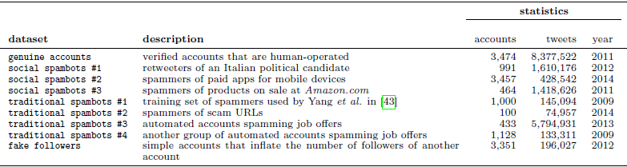

## Contents
{:.no_toc}
*  
{: toc}


```python
mport numpy as np
import pandas as pd
import csv
from langdetect import detect
import datetime
```


To quickly accumulate the twitter dataset we need, we decided to use twitter dataset from MIB, http://mib.projects.iit.cnr.it/dataset.html, which hosted by Institute of Infomatics and Telmatics of the Italian National Research council. It has the following data collection.



We randomly selected 100 humans from genuine accounts and 100 from traditional spambots #1. The data size is a tunable parameter. The reason for reduce number of accounts is when joining with tweets dataset to get a combine dataset between user account and tweets per account. . If 1 account has 10 tweets on average then when we join them, 100 $*$ 10 tweets = 1000 observations $*$ 2 class (bot/human) = 2000 observations. This is just to limit the training time and get the result in reasonable time if we doing it on Jupyterhub.


#### Creating user sample discussion ####

We selected a smaller sample of 100 users, bots who meet our following conditions:
    1. English tweeters so we can do NLP on tweeted text.
    2. Tweeted between 100 to 300 times.
    
We need to start with tweets.csv first as not every user in users.csv has actual tweets in tweets.csv. One technical problem here is the tweets.csv is nearly 1 GB and pd.read_csv() causes out of memory error when it tried to read the entire file into memory. Instead, we will filter line line by from tweets.csv to avoid out of memory error. Even with a relatively clean dataset, there is still '', and 'NA' in user_id column that still need to filter out from tweets.csv


```python

def create_100_sample_users(in_tweets_file, in_users_file, out_tweets_file, out_users_file):
    # in_tweets_file - original input tweets file location
    # in_users_file - original input users file location
    # out_tweets_file - sample tweets from 100 selected users
    # out_users_file - sample 100 selected users
    
    # get users_100.csv
    tweets_user_df = pd.read_csv(in_tweets_file, usecols=['user_id'], dtype = {'user_id': float}, na_values=['','NA'], keep_default_na=False)
    users_df = pd.read_csv(in_users_file,dtype = {'id': float}, na_values=['','NA'], keep_default_na=False)
    tweets_user_count = tweets_user_df.groupby(['user_id']).size().reset_index(name='counts')
    tweets_user_count = tweets_user_count[tweets_user_count.counts.between(100,1000, inclusive=True)].sort_values(by=['counts'],ascending=True).set_index('user_id')
    selected_users_df = users_df.join(tweets_user_count, on='id',how='inner')
    eng_selected_users_df = selected_users_df[selected_users_df.lang == 'en']
    eng_selected_users_df = eng_selected_users_df.sort_values(by=['counts'],ascending=True).head(100) 
    eng_selected_users_df.to_csv(out_users_file)
    id_df = eng_selected_users_df[['id']]
    
    # get the tweets_100.csv
    # TODO: make this code run faster
    row_count = 0
    with open(out_tweets_file, mode='w', encoding='utf-8') as tweets_file:
        for row in pd.read_csv(in_tweets_file, dtype = {'user_id': float}, 
                               na_values=['','NA'],keep_default_na=False, chunksize=1):
            
            if row['user_id'].isin(id_df['id']).any():
                if row_count == 0: # header row
                    row.to_csv(tweets_file, mode='a', header=True, encoding='utf-8')
                    row_count += 1
                else:
                    row.to_csv(tweets_file, mode='a', header=False, encoding='utf-8')
                    row_count += 1
                
    print('tweets row count = %d' % row_count )

def df_detect_en(df):
    
    # Input is a dataframe (df) to check for english 
    # Dataframe with the new "lang" column is returned.
    # It used 3 columns to determine the user is english or not
    # name, descripition, location
    
    def detect_en(name,desc,loc):
        langs = []
        try:
            if name is not None:
                langs.append(detect(name))
        except:
            langs.append('unk')
            
        try:
            if desc is not None:
                langs.append(detect(desc))
        except:
            langs.append('unk')

        try:
            if loc is not None:
                langs.append(detect(loc))
        except:
            langs.append('unk')
            
                
        if 'en' in langs:
            return 'en'
        else:
            return 'unk'
    
    df['lang'] = df[['name','description','location']].apply(lambda x: detect_en(*x),axis=1)
    return(df)

def create_100_bot_users(in_tweets_file, in_users_file, out_tweets_file, out_users_file):
    # in_tweets_file - original input tweets file location
    # in_users_file - original input users file location
    # out_tweets_file - sample tweets from 100 selected users
    # out_users_file - sample 100 selected users
    
    # get users_100.csv
    tweets_user_df = pd.read_csv(in_tweets_file, usecols=['user_id'], dtype = {'user_id': float}, na_values=['','NA'], keep_default_na=False)
    users_df = pd.read_csv(in_users_file,dtype = {'id': float}, na_values=['','NA'], keep_default_na=False)
    tweets_user_count = tweets_user_df.groupby(['user_id']).size().reset_index(name='counts')
    #tweets_user_count = tweets_user_count[tweets_user_count.counts.between(10,1000, inclusive=True)].sort_values(by=['counts'],ascending=True).set_index('user_id')
    tweets_user_count = tweets_user_count.sort_values(by=['counts'],ascending=True).set_index('user_id')
    selected_users_df = users_df.join(tweets_user_count, on='id',how='inner') 
    eng_selected_users_df = selected_users_df[selected_users_df.lang == 'en'] # get only english user
    
    # block this out so we get more tweets. There is no guarantee these english users has any tweets in tweets.csv
    eng_selected_users_df = eng_selected_users_df.sort_values(by=['counts'],ascending=True)
    eng_selected_users_df.to_csv(out_users_file, mode='w', header=True, encoding='utf-8')
    
    id_df = eng_selected_users_df[['id','counts']].set_index('id')
    
    # get the tweets_100.csv
    row_count = 0
    with open(out_tweets_file, mode='w', encoding='utf-8') as tweets_file:
        tweets_df = pd.read_csv(in_tweets_file, dtype = {'user_id': float}
                                ,na_values=['','NA'],keep_default_na=False)
            
        selected_tweets_df = tweets_df.join(id_df, on='user_id', how='inner')
        selected_tweets_df.to_csv(out_tweets_file, mode='a', header=True, encoding='utf-8')
        
        # now join with eng_selected_users to filter the users that actual tweets.
        #selected_tweets_count_df = selected_tweets_df.groupby(['user_id']).size().reset_index(name='counts')
        #selected_tweets_count_df = selected_tweets_count_df.sort_values(by=['counts'],ascending=True).set_index('user_id')
        #selected_tweets_count_df = selected_tweets_count_df.drop('counts',axis=1)
        #print(selected_tweets_count_df.shape, eng_selected_users_df.shape)
        #eng_user_has_tweets_df = eng_selected_users_df.join(selected_tweets_count_df, on='id', how='inner')
        #eng_user_has_tweets_df.to_csv(out_users_file, mode='a', header=True, encoding='utf-8')
        
                
```


```python
#create_100_sample_users('data/genuine_accounts.csv/tweets.csv', 'data/genuine_accounts.csv/users.csv','clean/human_tweets_100.csv' ,'clean/human_users_100.csv')
```


#### Creating sample traditional bots discussion ####

The processing of traditional bots is slightly different from processing human tweets. The language field is NULL and we have to use langdectect modules to scan the name, location, and description column to detect if the user is an English Twitter users. We need the tweets to be in English to run NLP, sentimental analysis. etc..


```python
bot_users_df = pd.read_csv('data/traditional_spambots_1.csv/users.csv', dtype = {'id': float}, na_values=['','NA'], keep_default_na=False)
bot_users_df['lang'] = 'unk'
bot_users_df = df_detect_en(bot_users_df)
bot_users_df.to_csv('data/traditional_spambots_1.csv/users2.csv',encoding='utf-8')
```


```python
create_100_bot_users('data/traditional_spambots_1.csv/tweets.csv', 'data/traditional_spambots_1.csv/users2.csv','clean/bot_tweets_100.csv' ,'clean/bot_users_100.csv') 
```


#### Creating social spam bots discussion ####

Social spam bots are made themselves look like another human users. We can reuse the code for human sample extraction. The downside is it is much harder to make distinction between them and human users.


```python
create_100_sample_users('data/social_spambots_2.csv/tweets.csv', 'data/social_spambots_2.csv/users.csv','clean/social_tweets_100.csv' ,'clean/social_users_100.csv')
```


#### Create response field discussion ####

We need to add response 'user_type' column to sample tweets and users for both bots and humans dataset. The user_type = 1 if human and 0 if it is a bot. We will use this field to stratify when splitting train/test/validation dataset.


```python
human_users_df = pd.read_csv('clean/human_users_100.csv')
human_users_df = human_users_df.assign(user_type=1)
human_tweets_df = pd.read_csv('clean/human_tweets_100.csv')
human_tweets_df = human_tweets_df.assign(user_type=1)

bot_users_df = pd.read_csv('clean/bot_users_100.csv')
bot_users_df = bot_users_df.assign(user_type=0)
bot_tweets_df = pd.read_csv('clean/bot_tweets_100.csv')
bot_tweets_df = bot_tweets_df.assign(user_type=0)

social_users_df = pd.read_csv('clean/social_users_100.csv')
social_users_df = social_users_df.assign(user_type=0)
social_tweets_df = pd.read_csv('clean/social_tweets_100.csv')
social_tweets_df = social_tweets_df.assign(user_type=0)

```


```python
human_users_df.to_csv('feature/human_users_100.csv', encoding='utf-8')
human_tweets_df.to_csv('feature/human_tweets_100.csv', encoding='utf-8')
bot_users_df.to_csv('feature/bot_users_100.csv', encoding='utf-8')
bot_tweets_df.to_csv('feature/bot_tweets_100.csv', encoding='utf-8')
social_users_df.to_csv('feature/social_users_100.csv', encoding='utf-8')
social_tweets_df.to_csv('feature/social_tweets_100.csv', encoding='utf-8')

```


#### Create tweeting rate field ####

We create multiindex ['userid','timestamp'] where timestamp is DateTimeIndex object. We can use that indexes to count daily tweet rate of each user.


```python
human_tweets_df = pd.read_csv('feature/human_tweets_100.csv')
bot_tweets_df = pd.read_csv('feature/bot_tweets_100.csv')
social_tweets_df = pd.read_csv('feature/social_tweets_100.csv')

```


```python
human_tweets_df['timestamp'] = pd.to_datetime(human_tweets_df.timestamp)
bot_tweets_df['timestamp'] = pd.to_datetime(bot_tweets_df.timestamp)
social_tweets_df['timestamp'] = pd.to_datetime(social_tweets_df.timestamp)

human_tweets_df['timestamp'] = human_tweets_df["timestamp"].apply( lambda human_tweets_df : 
datetime.datetime(year=human_tweets_df.year, month=human_tweets_df.month, day=human_tweets_df.day))
human_tweets_df.set_index(['user_id',"timestamp"],inplace=True)

bot_tweets_df['timestamp'] = bot_tweets_df["timestamp"].apply( lambda bot_tweets_df : 
datetime.datetime(year=bot_tweets_df.year, month=bot_tweets_df.month, day=bot_tweets_df.day))
bot_tweets_df.set_index(['user_id',"timestamp"],inplace=True)

social_tweets_df['timestamp'] = social_tweets_df["timestamp"].apply( lambda social_tweets_df : 
datetime.datetime(year=social_tweets_df.year, month=social_tweets_df.month, day=social_tweets_df.day))
social_tweets_df.set_index(['user_id',"timestamp"],inplace=True)


```

