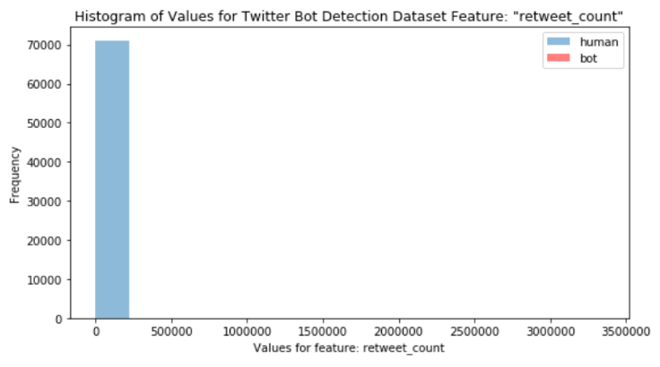
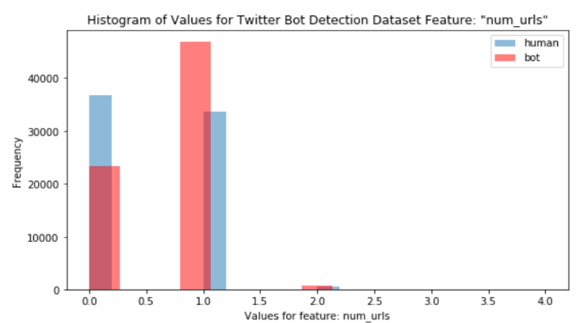
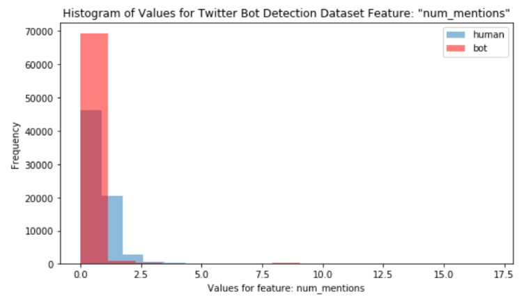
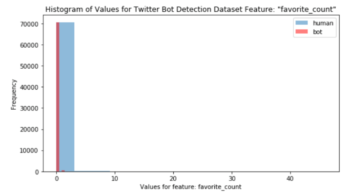

As stated in the project statement, we want to classify the tweets were from 
bots or humans. Our primary focus was to identify the most important features from 
the tweets dataset.

#### Summary of EDA Results

Table 1 shows the results of EDA and important feature selection. 

|Features        |Description                       |
|:---------------|:---------------------------------|
| favorite count | count # of likes                  |
| num hashtags   | # of hashtags used in tweets      |
| num urls       | # of urls used in tweets          |
| num mentions   | # of mentions of your @<username> |
| retweet count  | # of retweets                     |

#### Data Collection

We decided to use the Twitter dataset from MIB [Reference ?]. 
From this data collection, we randomly selected a subset of human and bot tweets. 
This help us to train the models in a reasonable time with limited compute resources.

#### Creating Data Sample

One technical problem we encountered was out of memory error when processing
the nearly 1GB tweets.csv file. Our workaround was to
filter in small chunk size. Even though this was a relatively clean dataset, we
still encountered empty fields and 'NA' in the user\_id column which we
cleaned.

The processing of traditional bots was slightly different from
processing human tweets because the language field in the traditional
bot dataset was empty. We employed language detection modules to scan
the name, location, and description column to detect if the user was an
English Language Twitter users. This step was necessary to prepare the
data for NLP technique application. Social spam bots are built to mimic
human users, so we were able to use the human sample extraction code on
these bots.

#### Create response variable

We added our classification response variable, called 'user\_type' to
tweet-level datasets. The user_type was set as
a Boolean field and indicated a human if 1 and a bot if 0. We planned to
also use this field for stratified sampling when generating
train/test/validation datasets.

#### EDA and Feature Selection for Tweet-Level Data

Results of analyzing features indicated that the most useful fields for
our classification efforts are: **retweet count, favorite count, num
hashtags, num urls, and num mentions and sentiment\_negative**. 
Analyzing the .info() output shows us that five of the features are empty 
or have 0 for every value and we will drop these from the dataset: 
'geo', 'contributors', 'favorited', 'possibly\_sensitive', 'retweeted', 'reply\_count'.

Since we are not performing any network analysis, we will also drop the
'in\_reply\_to\_status\_id', 'in\_reply\_to\_user\_id',
'retweeted\_status\_id', which are fields that can be used to
reconstruct communications connectivity of an individual tweet. Other
fields that we removed were id source, created\_at, crawled\_at, and
updated. Since we are not performing time series analysis, we will also
remove timestamp.

Correlation matrices were generated to identify linear relationships
between features. Pairplots were generated for the remaining 14 features
to identify non-linear correlation. Strong linear correlation was
identified between the positive and neutral sentiment features. These
sentiment features were generated by applying the sentiment analysis
methods built in the textblob library to the tweet texts. This model,
trained on labeled movie review data, classifies text as either neutral,
positive or negative in sentiment.

Next, overlayed feature histograms were plotted to identify features
that would help the models discriminate between the two classes. The
following showed the strongest predictive value. The “retweet\_count“
was almost entirely a human behavior. Notice any bot contributions are
so small that they are not indicated in the plot.

“Num\_urls” showed strong profiles for bots in having 1 url whereas
humans had a nearly even frequency of values.

 

**Figure 1: Retweet Count and Num Urls Histograms**

Num\_mentions and favorite\_count had opposite predictive strengths,
with a greater than zero favorite count being strongly human, and 0
num\_mentions being strongly bot related

 

**Figure 2: Num\_mentions and Favorite Count Histograms**

We also performed filtering based on low variance features by using
sklearn's variance threshold method which resulted in the following
features: *retweet\_count, favorite\_count, num\_hashtags, num\_urls,
num\_mentions*. .

