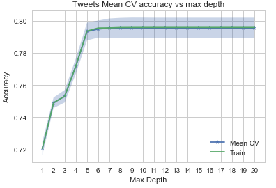
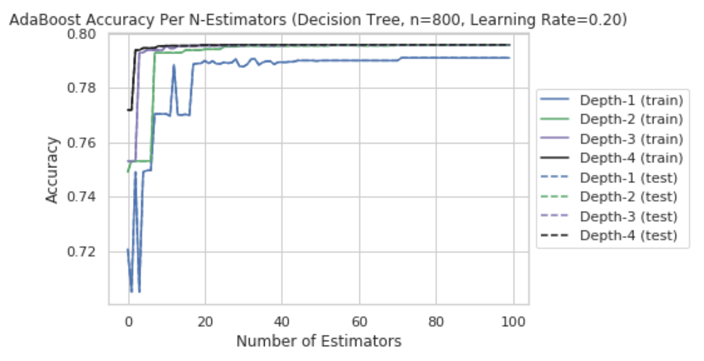
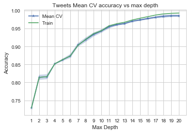
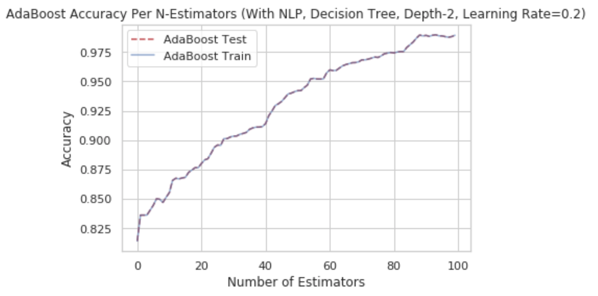

#### Baseline and NLP features

Based on EDA and feature selection, we chose the following baseline features and NLP features. Please refer back to EDA and NLP pages for more details about the selected features

|Baseline features|NLP features|Lexical Diversity features|
|:----------------|:-----------|:-----------|
|retweet_count|sentiment_negative|LD-log_ttr|
|favorite_count|sentiment_neutral|LD-uber_index|
|num_urls|sentiment_positive|LD-yule_s_k|
|num_mentions|token_count|LD-mtld|
|num_hashtags|url_token_ratio|LD-hdd|
| |ratio_neg|
| |ant|
| |fear|
| |joy|
| |trust|
| |jaccard|

### Evaluate Model Accuracy with Baseline Features
#### kNN with Baseline features
We have a fairly large number of tweets (over 100K). kNN takes forever to run. We decided drop the kNN from further evaluation.  

```python
all_tweets_df = all_tweets[['retweet_count', 'favorite_count', 'num_hashtags', 'num_urls', 'num_mentions','user_type']]
train_base_tweets_df, test_base_tweets_df = train_test_split(all_tweets_df, test_size=0.33, random_state=42,
                                                              stratify=all_tweets_df['user_type'])

X_train, y_train = train_base_tweets_df.drop('user_type',axis=1), train_base_tweets_df['user_type']
X_test, y_test = test_base_tweets_df.drop('user_type',axis=1), test_base_tweets_df['user_type']
Xs_train, Xs_test = scale(X_train), scale(X_test)

neighbors, train_scores, cvmeans, cvstds, cv_scores = [], [], [], [], []
for n in range(1,11):
    neighbors.append(n)
    knn = KNeighborsClassifier(n_neighbors = n)
    train_scores.append(knn.fit(X_train, y_train).score(X_train, y_train))
    scores = cross_val_score(estimator=knn,X=Xs_train, y=y_train, cv=5)
    cvmeans.append(scores.mean())
    cvstds.append(scores.std())
```
#### Logistic Regression (Cross Validated) with Baseline features
Logistic Regression could only achieve a test accuracy of 74%.

```python
model_log_cv_base = LogisticRegressionCV(cv = 5).fit(xtrain_base, ytrain_base)

train_score_logcv_base = model_log_cv_base.score(xtrain_base, ytrain_base)
test_score_logcv_base = model_log_cv_base.score(xtest_base, ytest_base)
print("Log Regression Model Accuracy with Base Features (Train) is ",train_score_logcv_base)
print("Log Regression Model Accuracy with Base Features (Test) is ",test_score_logcv_base)
```

    Log Regression Model Accuracy with Base Features (Train) is  0.7662645518405441
    Log Regression Model Accuracy with Base Features (Test) is  0.7640225772312654


#### LDA/QDA with Baseline Features
LDA and QDA performed poorly. They are in the range of 71-75% accuracy. Also note that LDA/QDA perform well with
low number of observations according to class lecture. Note we have over 100K observations.

```python
X_train, y_train = train_base_tweets_df.drop('user_type',axis=1), train_base_tweets_df['user_type']
X_test, y_test = test_base_tweets_df.drop('user_type',axis=1), test_base_tweets_df['user_type']

lda = LinearDiscriminantAnalysis().fit(X_train, y_train)
qda = QuadraticDiscriminantAnalysis().fit(X_train, y_train)
```

#### Decision Tree/RandomForest with Baseline Features
The Decision Tree performed well here. After tree depth = 7, the accuracy is not improving.
We pick 7 as the optimal tree depth for RandomForest. Given the tree accuracy is fairly
constant, the accuracy is ~ 79% for both models.

```python
depths, train_scores, cvmeans, cvstds, cv_scores = [], [], [], [], []
for depth in range(1,21):
    depths.append(depth)
    dt = DecisionTreeClassifier(max_depth=depth)
    train_scores.append(dt.fit(X_train, y_train).score(X_train, y_train))
    scores = cross_val_score(estimator=dt, X=X_train, y=y_train, cv=5)
    cvmeans.append(scores.mean())
    cvstds.append(scores.std())
```


```python
fitted_rf = RandomForestClassifier(n_estimators=7, max_depth=7).fit(X_train,y_train)
random_forest_train_score = fitted_rf.score(X_train, y_train)
random_forest_test_score = fitted_rf.score(X_test, y_test)
```

#### AdaBoost with Baseline Features

We tuned the parameters of the AdaBoost model and picked a Learning Rate of 0.2, Depth of 2, and 100 estimators to balance accuracy with complexity.



Using those parameters, the AdaBoost model achieved 79% accuracy on the baseline features; only slightly better than Logistic Regression.

```python

```python
#modified from lab 9 notes
def adaboost_build_and_plot(data_tuple, max_depth, n_estimators, learning_rate, makeplot=False, title_or=''):
    X_train = data_tuple[0]
    y_train = data_tuple[1]
    X_test = data_tuple[0]
    y_test = data_tuple[1]

    if len(title_or) > 0:
        title = title_or
    else:
        title = 'AdaBoost Accuracy Per N-Estimators (Decision Tree, Depth-' + str(max_depth) + ', Learning Rate=' + \
                str(learning_rate) + ')'

    skadaboost = AdaBoostClassifier(base_estimator=DecisionTreeClassifier(max_depth=max_depth),
                              n_estimators=n_estimators, learning_rate=learning_rate)
    skadaboost.fit(X_train, y_train)
    print('AdaBoost Accuracy (train)', skadaboost.score(X_train, y_train))
    print('AdaBoost Accuracy (test)', skadaboost.score(X_test, y_test))

    if makeplot == True:

        staged_scores_test = skadaboost.staged_score(X_test, y_test)
        staged_scores_train = skadaboost.staged_score(X_train, y_train)
        plt.figure()
        plt.plot(np.arange(0,n_estimators),list(staged_scores_test), label='AdaBoost Test', linestyle='dashed', color='r')
        plt.plot(np.arange(0,n_estimators),list(staged_scores_train), label='AdaBoost Train', color='b', alpha = 0.6)
        plt.title(title)
        plt.xlabel('Number of Estimators')
        plt.ylabel('Accuracy')
        plt.legend()

t0 = time()
adaboost_build_and_plot(splits['base'], 2, 100, 0.2, makeplot=True)
print("done in %0.3fs." % (time() - t0))
```


    AdaBoost Accuracy (train) 0.7955792191029364
    AdaBoost Accuracy (test) 0.7955792191029364
    done in 7.316s.

### Evaluate Model Accuracy for Extended Features (Baseline + NLP Features)
Next we used the same model techniques used on the baseline features on the extended features (baseline and NLP features. We observed that accuracy improved for most models with the addition of NLP features.

#### Logistic Regression (Cross Validated) with Extended Features
Logistic Regression accuracy improved by 6% with the inclusion of NLP features, reporting an accuracy of 82%.

```python
model_log_cv = LogisticRegressionCV(cv = 5).fit(xtrain_nlp, ytrain_nlp)

train_score_logcv_nlp = model_log_cv.score(xtrain_nlp, ytrain_nlp)
test_score_logcv_nlp = model_log_cv.score(xtest_nlp, ytest_nlp)
print("Log Regression Model Accuracy with NLP (Train) is ",train_score_logcv_nlp)
print("Log Regression Model Accuracy with NLP (Test) is ",test_score_logcv_nlp)
```

    Log Regression Model Accuracy with NLP (Train) is  0.8250179958795641
    Log Regression Model Accuracy with NLP (Test) is  0.8247492818626215


#### LDA/QDA with Extended Features
Even with NLP features added, the accuracy of the LDA is 81% and 75% for QDA. We decided to drop
these models from further evaluation and concentrated on the models that are doing really well.


#### Decision Tree/RandomForest with Extended Features

With the addition of NLP features, the DecisionTreeClassifier accuracy improved dramatically.
The graph shows over fitting starting at depth = 13. We will select depth = 12 as the optimal
depth for RandomForest. The RandomForestClassifier accuracy is lower than decision tree because it
is an average result over multiple estimators (DecisionTree).  

```python
# Base + NLP features
all_tweets_df = all_tweets[['retweet_count', 'favorite_count', 'num_hashtags', 'num_urls',
'num_mentions','user_type', 'sentiment_negative', 'sentiment_neutral', 'sentiment_positive',
'token_count', 'url_token_ratio', 'ratio_neg', 'ant', 'fear', 'joy', 'trust','jaccard']]

#Choosing the best depth
idx = depths.index(12)
print("Accuracy: Mean={:.3f}, +/- 2 SD: [{:.3f} -- {:.3f}]".format(
    cvmeans[idx], cvmeans[idx] - 2*cvstds[idx], cvmeans[idx] + 2*cvstds[idx]))

Accuracy: Mean=0.961, +/- 2 SD: [0.958 -- 0.964]   
The Random Forest scored 0.928 on the training set.
The Random Forest scored 0.923 on the test set.
```                            



#### AdaBoost Accuracy with Extended features

As seen below, the addition of the NLP features improved the accuracy of the model by nearly 20%.



```python
adaboost_build_and_plot(splits['nlp'],2,100,0.2, makeplot=True, title_or="AdaBoost Accuracy Per N-Estimators (With NLP, Decision Tree, Depth-2, Learning Rate=0.2)")
print("done in %0.3fs." % (time() - t0))
```

    AdaBoost Accuracy (train) 0.9893017598729119
    AdaBoost Accuracy (test) 0.9893017598729119
    done in 11.563s.
